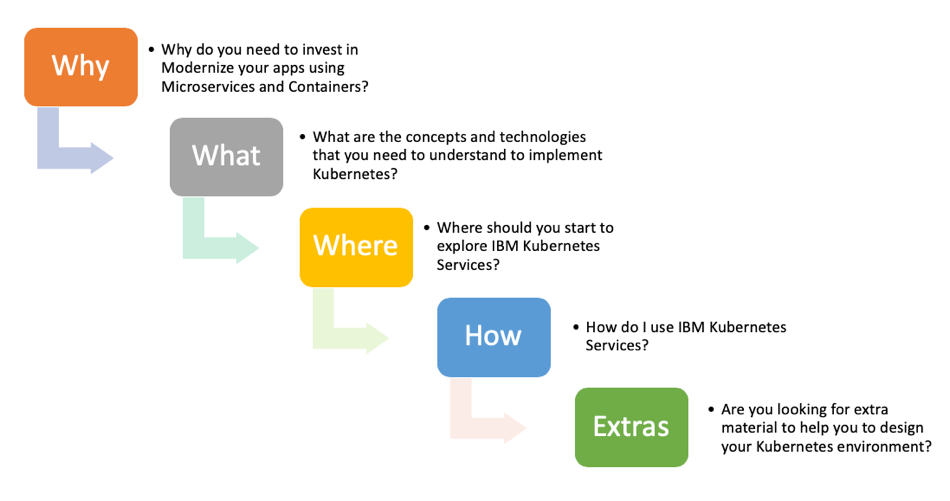

<h3>IBM Kubernetes Services</h3>
IBM Cloud™ Kubernetes Service is a managed container service for the rapid delivery of applications that can bind to advanced services like IBM Watson® and blockchain. As a certified K8s provider, IBM Cloud Kubernetes Service provides intelligent scheduling, self-healing, horizontal scaling, service discovery and load balancing, automated rollouts and rollbacks, and secret and configuration management. The Kubernetes service also has advanced capabilities around simplified cluster management, container security and isolation policies, the ability to design your own cluster, and integrated operational tools for consistency in deployment.

<h3>About this Experience</h3>
This **Experience** will help you to explore IBM Cloud Kubernetes Service. As Kubernetes increasingly becomes the industry standard, you will have the ability to port Kubernetes-based containers into IBM Cloud, and take advantage of automated DevTest, CI/CD and 170+ PaaS services related to DevOps, data analytics, blockchain and Watson.

This material has 5 parts:

 

 

<ul>
<li><b>Why</b>: In the why part, you will learn why you should invest in modernize your apps or create new apps using microservices and containers. Here you will learn the usecase and business benefits behing Kubernetes.</li>
<li><b>What</b>: In this part, you will learn what are the tecnhologies and concepts behind Kubernetes. Here you will understand what is Containers, Kubernetes and a Managed Kubernete Service</li>
<li><b>Where</b>: In this part, you will learn where to start. Here you will see all the pre-requisites to follow the "How" part</li>
<li><b>How</b>: In this part, you will learn how to use and explore IBM Kubernetes Service. Here is the hands-on part. Because we have multiple hands-on labs, here you will see multiple "How" parts. Enjoy it!</li>
<li><b>Extras</b>: Last but not least, you will be able to explore some extra materials, with tips how to design your Kubernetes environment, for example: Security, Resilience, etc.</li>
</ul>

**Now, it is time to start! We are happy that you decided to invest your time to learn about IBM Kubernetes Service. Enjoy your journey!**
