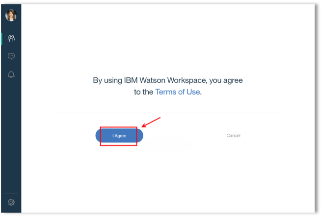
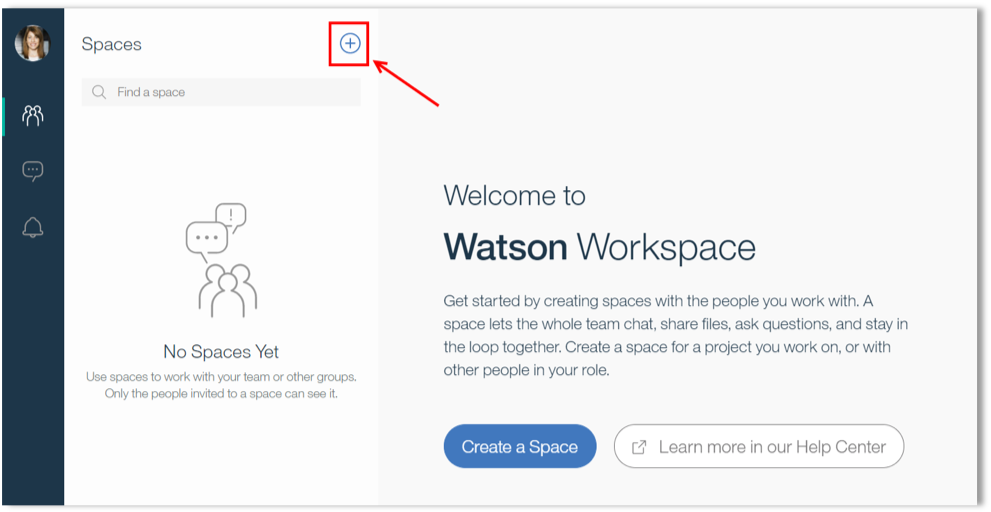

<a name="top"/>

<h4>Creating a Workspace Space</h4>

In this exercise, you will create one Workspace space to use our apps.  This section is mandatory for all other mini-labs.

`_1.` In your private/anonymous browser window, open a new tab.

`_2.` Open the <a href="https://login.workspace.ibm.com/" target="blank" >IBM Watson Workspace login page</a>.

`_3.` Login with your **IBMid** and **password**.

`_4.` If you see the "*Terms of Use*" screen, click **"I Agree"**.

`_5.` Because Workspace Preview is a free and public environment, you are welcome to invite your colleagues to enjoy this new Intelligent Conversation Platform.
 
The majority of your work in Watson Workspace occurs in spaces. A space can be created for any purpose, like a quick chat to coordinate a project, or as a place for your team to collaborate.  Anyone can create a space and can then add others to participate. Now, you will create a new space for a Sales Team, and later you will add an application to motivate the sales team. Click on the “**Create a Space**” button.

`_6.` Enter "**Sales Team**" (1) as the space name and click "**Add People**" (2).

`_7.` On the next screen, you are able to invite other users to your space. However, you don’t need to add anybody yet. Then click **Create**.

`_8.` Congratulations! You have a space to use your apps. However before start your apps, please take note of the Space ID. This information is available on the URL after the "**/space/**" string (see the picture below). You will use the id later on the first lab.

*Great Job! Now you are ready to create your apps.*

 
[Back to Top](#top)  
