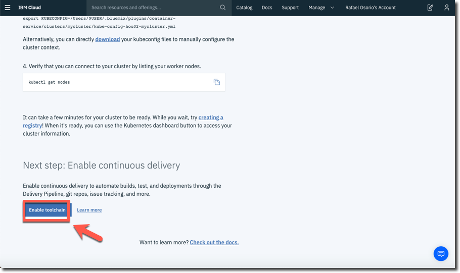

<a name="top"/>

In this section, you will create an open toolchain, and then use the toolchain and DevOps practices to develop a simple "Hello World" web application that you deploy to the IBM Cloud™ Kubernetes Service with a Kubernetes cluster. The toolchain includes Vulnerability Advisor to provide a secure container. In addition to scanning for security issues, other DevOps practices you will follow include use of a Git repository and continuous build.

`_1.` On the "mycluster" Access page, scroll down to the end page and click *"Enable Toolchain"*.
 

 

`_2.` Keep **mycluster (1)** as cluster name and click **Create cluster (2)**.
 

 

`_3.` The cluster deployment status is shown. Typically, this process takes about 20 minutes.
 

 

`_4.` When the status is "**Normal**" you can start to use your cluster to deploy your applications (not part of this lab).
 

 

 
[Back to Top](#top)  
