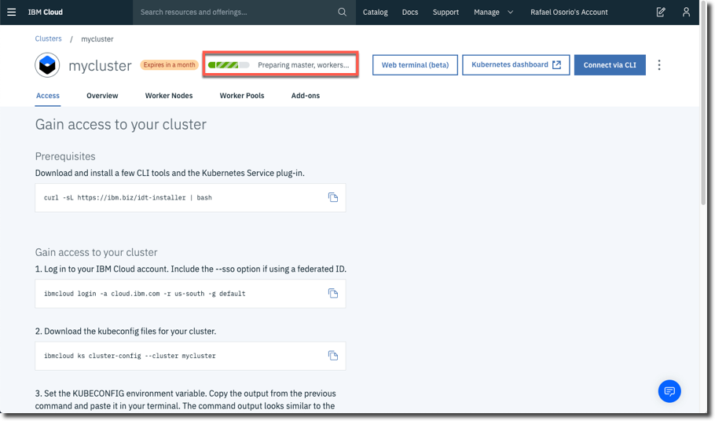

<a name="top"/>

In this section, you set up the cluster's initial configuration and deploy an application to the cluster. The step begins on the "Create a new cluster" page.

`_1.` If you are using a Lite account, you are not able to create a Kubernete cluster. You need to **upgrade** your account for a "Pay as You Go" model. As soon as you include a Credit Card, you will be able to create a **Free** cluster.  For the purpose of this lab, you just need a Free cluster (cluster with 1 worker node). Click on **Free** button.
 

 

`_2.` Keep **mycluster (1)** as cluster name and click **Create cluster (2)**.
 

 

`_3.` The cluster deployment status is shown. Typically, this process takes about 20 minutes.
 

 

`_4.` When the status is "**Ready**" you can deploy the application to the cluster.

 
[Back to Top](#top)  
