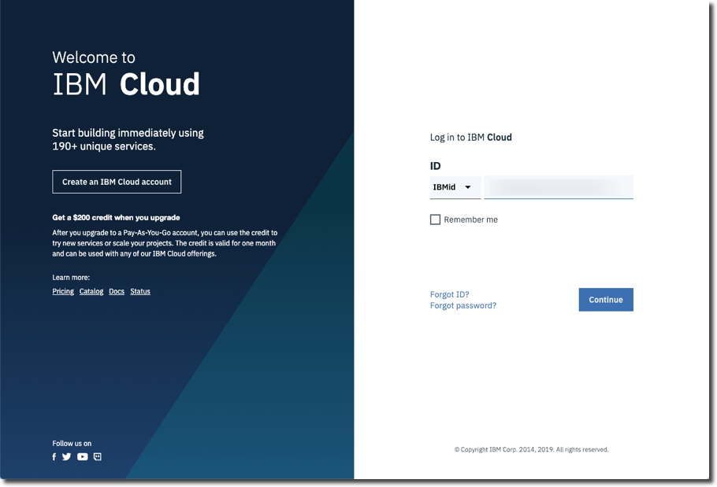
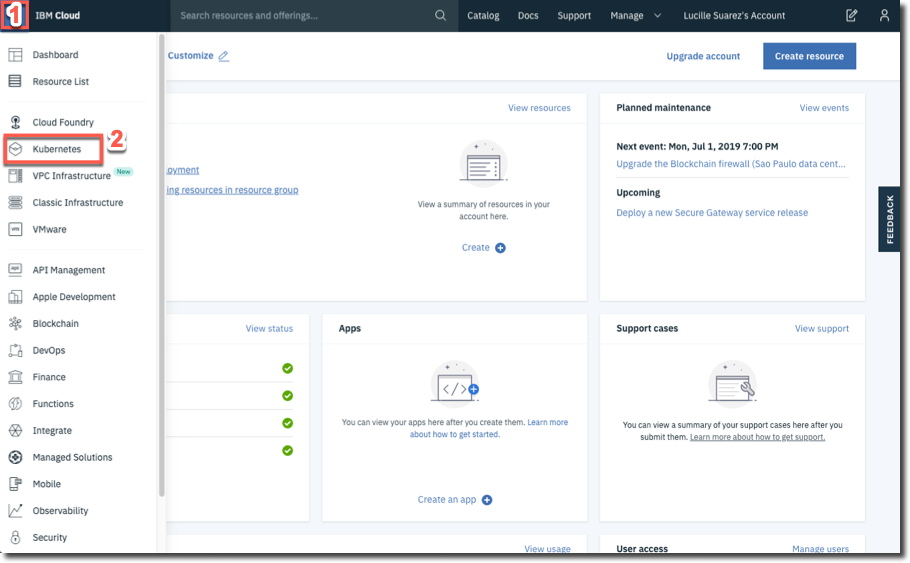

<a name="top"/>

When you have an IBM Cloud account, deploying a Kubernetes cluster is a straightforward process. In this task, you create an instance of the service.

`_1.` Open the <a href="https://cloud.ibm.com/" target="blank" >IBM Cloud page</a>. Log in with your account.

`_2.` On the top of the page, open the **Navigation Menu (1)** and select **Kubernetes (2)**.

`_3.` Click “**Create Cluster**”.

 
[Back to Top](#top)  
