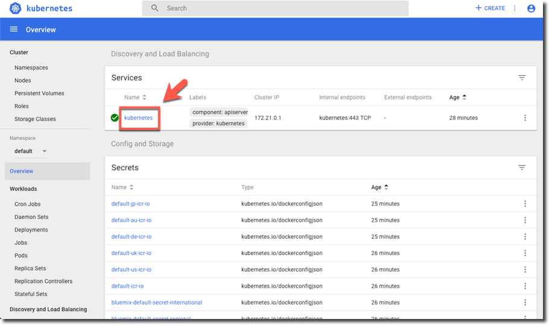

<a name="top"/>

In this final section you will see how to use the dashboard to monitor the cluster.

`_1.` Click “**Kubernetes Dashboard**” button.
 

 

`_2.` On the dashboard, select **Kubernetes** service.
 

 

`_3.` On the dashboard, you can monitor the cluster and the pods that are in it. By now, you don't have any pod yet. In the next lab, you will see how to create it and deploy an application.
 

 

*Congratulations! Here you finished the first lab. You learned how simple is to deploy a IBM Cloud Kubernetes Service cluster and how to monitor your cluster by using the dashboard.*

 
[Back to Top](#top)  
