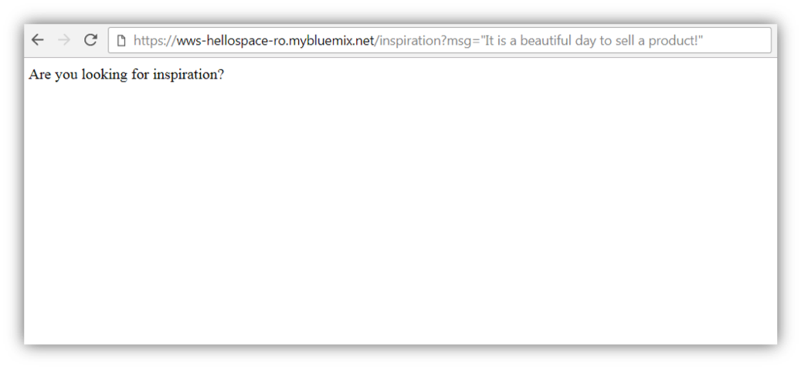

<a name="top"/>

In this section, you will learn how to improve your code to invoke external Rest Services. Here you will use the public Quote Rest API from TheySaidSo, more information available on <a href="https://theysaidso.com" target="blank">https://theysaidso.com</a>. They have a huge collection of quotes in their database, and you will access the quote of the day for a specific category, based in the user message. Let’s do it!

`_1.` Go back to the IBM Cloud browser tab, and go to the end of the “index.js” file and insert the code of the **getQuote** (1) function:
```
function getQuote(callback){
	var quoteURL = "http://quotes.rest/qod.json?category=inspire";

	// Issue the request
  	request.get(quoteURL, function(error, response, body) {
  		//Check for error
    	if (error) {
      		console.log("GetQuote - Error:", error);
			callback(true,null);
    	}
    	//Check for right status code
    	if (response.statusCode !== 200) {
      		console.log("Getquote : Error :", response.statusCode);
      		callback(true,null);
    	}
    	callback(false,JSON.parse(body));
	});
}
```
Let’s analyze the code! This code is a simple GET Request (2) for the Quote Rest API to get the quote of the day of the category “inspire”. At the end, the body parsed json is returned for the callback function (3). It is really simple!!!


`_2.` Now, let’s go back to the app.get code. Before the getJWTToken call (see picture below)

Insert the code below (there is a snippet available on:
```
getQuote(function(error, result) {
     if (!error) {
         myMsg = result.contents.quotes[0].quote;
```
Here you are only calling the new getQuote function to call the Quote REST API, and you are getting the quote json value and setting the message to be post on the space. Please ident your code, to look like the picture below:


`_3.` However you still has an error on the code (see the red icon at the end of the app.get. To fix it, you need to close the “if” and the “getQuote” call. Let’s do it! Before the “res.send” line, include the code below (see the details on the picture below):
```
    }
});
```


`_4.` Great! Now you are ready. Your code is sending the quote received from the Quote REST API, instead of the message received in the Query Parameter. Let’s test it! Click on “**Deploy**” button again (1). If you see a message asking if you want to re-deploy your message, please click **OK**.


`_5.` Open again your hellospace app browser and refresh the page with the same URL:
```
https://wws-hellospace-XX.mybluemix.net/inspiration?msg="It is a beautiful day to sell a product!”
```
And you should see the same generic message.


`_6.` But let’s see the result on the Workspace Space side. Go back to the Workspace page. On the “Workspace Lab” space check the new message posted by the “Inspirational JS Bot”. You should have a real inspirational quote that came from Quote Rest API.
<p>
<span class="label label-warning">Note</span>
your quote should be different of the picture bellow, since the API provides a different quote per day
</p>


If you want to change the category of the quote, you are welcome. The API provides sport, fun, life, etc. You just need to change the category query parameter of the “queryURL var” of the “getQuote” function, and redeploy your app.

*Congratulations! You learned how to create a Watson Work Services notification app that sends message to a space using Node.JS and external REST service. Next lab, you will see how to create an app to listen for events using Webhook API.*


<br/>
[Back to Top](#top)  
