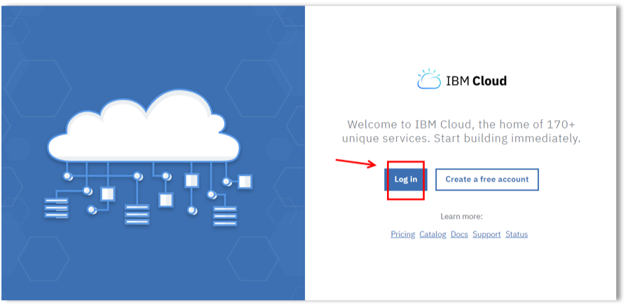
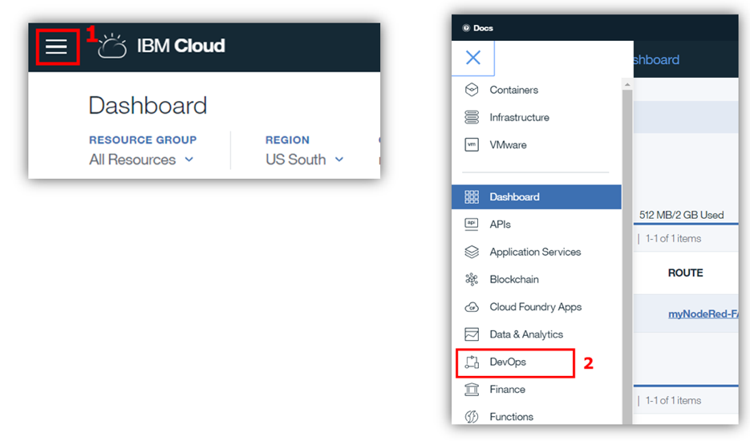
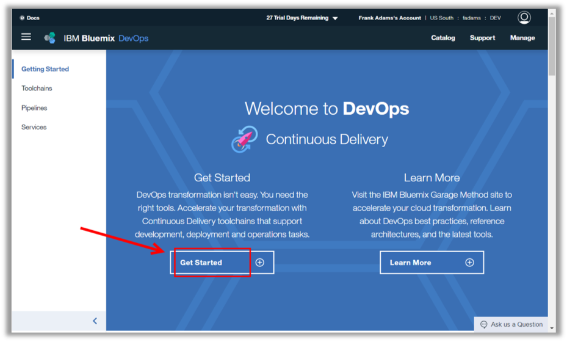
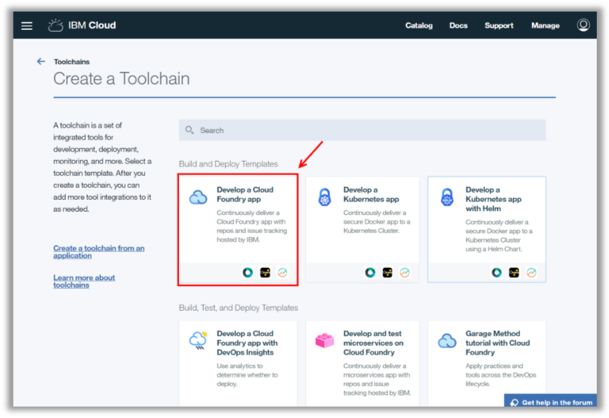
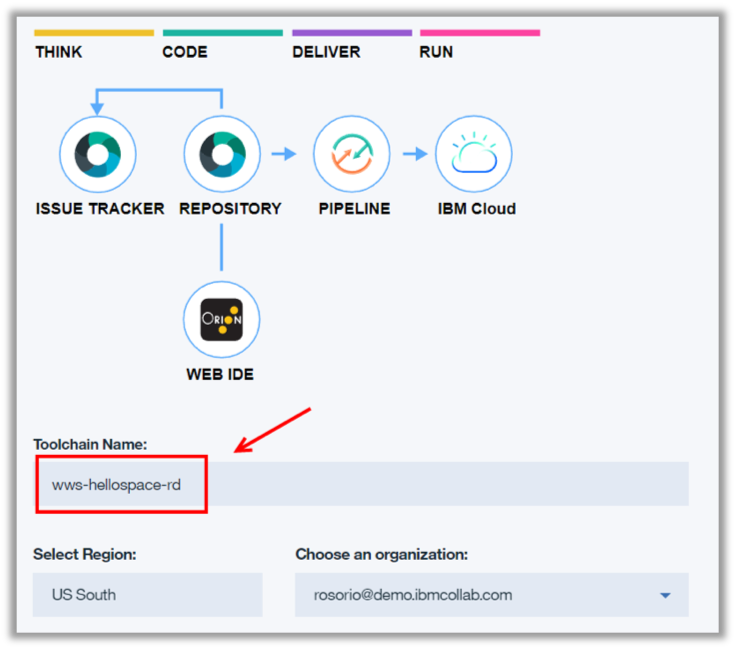
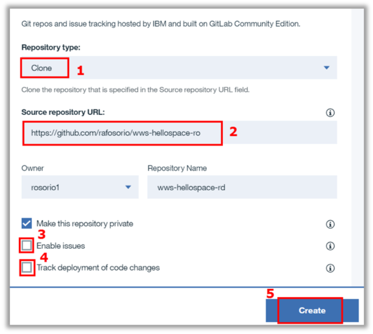

<a name="top"/>

`_1.` In your private/anonymous browser window, open a new tab.

`_2.` Open the <a href="https://console.bluemix.net/" target="blank" >IBM Cloud page</a>.

`_3.` Click “**Log In**” and access with your **user id** and **password**


`_4.` On the IBM Cloud Dashboard page, click to open the **Menu** (1). And Select the “**DevOps**” option (2).


`_5.` Now click on “**Get Started**” button to create a new Toolchain.


`_6.` Here you are able create a toolchain from a Toolchain Template. This decision depends on the type of project. In our case, we will use the “**Develop a Cloud Foundry app**” template.


`_7.` On the creation page, review the diagram of the toolchain that you are about to create. The diagram shows each tool integration in its lifecycle phase in the toolchain. On the Toolchain Name, enter "**wws-hellospace-**`<your initials>`**”.


`_8.` On the “Git Repos and Issue Tracking” section, select the “**Clone**” (1) as “**Repository type**”. On the “**Source repository URL**” enter (2):
```
https://github.com/rafosorio/wws-hellospace-ro
```
Keep the default value for “**Repository Name**” and disable “**Enable Issues**” (3) and **disable “Track deployment of code changes”** (4).  And click “**Create**” (5).



<p>
<span class="label label-warning">Take Note</span>
Here you defined that you want to clone an app of a specific URL. Behind the scenes you are copying a pre-created App. This is a basic Node.JS app that we will use as a start point to create our Inspirational Bot.
</p>

*Great Job! Your toolchain is ready! In the next section, you will use this app as a start point to create your app.*

<br/>
[Back to Top](#top)  
