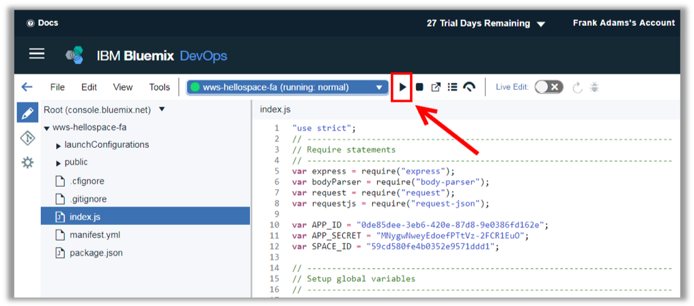
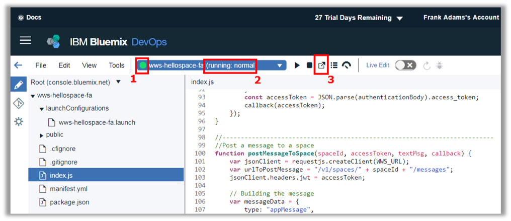
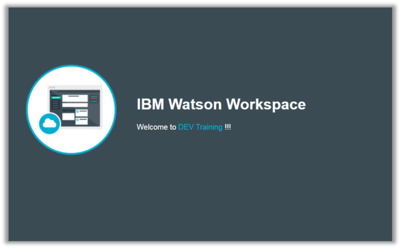
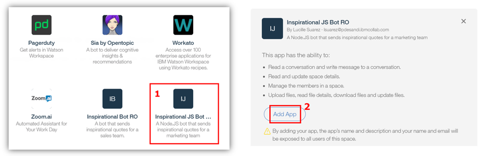
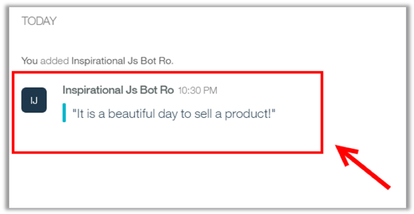

<a name="top"/>

In this section you will see how to deploy, run and test your new application in IBM Cloud DevOps Environment.

`_1.` Click on “**Deploy**” button.


`_2.` When ready, you should see the green circle again (1) and the running information (2).
Click on the “**Open the Deployed App**” button (3).


`_3.` Great Work! Here you should see the index.html page.


`_4.` Before we call our method to submit the message to the space, let’s add the app in the “Sales Team” space. Open the Workspace browser tab again, and the “**Sales Team**” space should be open (if not, please open it).


`_5.` On “Sales Team” space click on the “**Space Settings**” (you just need to click on the space’s name).


`_6.` Click “**Apps**”.


`_7.` Scroll down and click on your “**Inspirational JS Bot**” (1). Then click on “**Add App**”
button (2). And **close** the Space settings dialog.


`_8.` Let’s test our “inspiration” method to see if our app will send a message to space.  Call the URL:
```
https://wws-hellospace-XX.mybluemix.net/inspiration?msg="It is a beautiful day to sell a product!”
```  
Where XX is `<your initials>`.  Your result should be a basic string page to inform that the inspiration context was invoked. Let’s see the result on the Workspace Space side.


`_9.` Go back to the Workspace page. On the “Workspace Lab” space check the new message posted by the “Inspirational JS Bot”.

The use case here is really simple. However you can extend this code to consume business applications to provide message notifications in a space. Next section you will see how to do it.

<br/>
[Back to Top](#top)  
