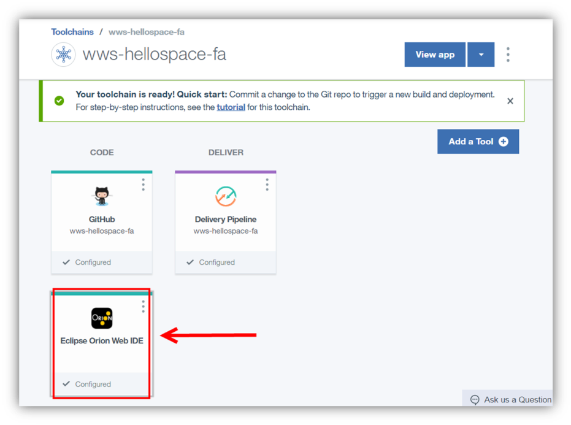
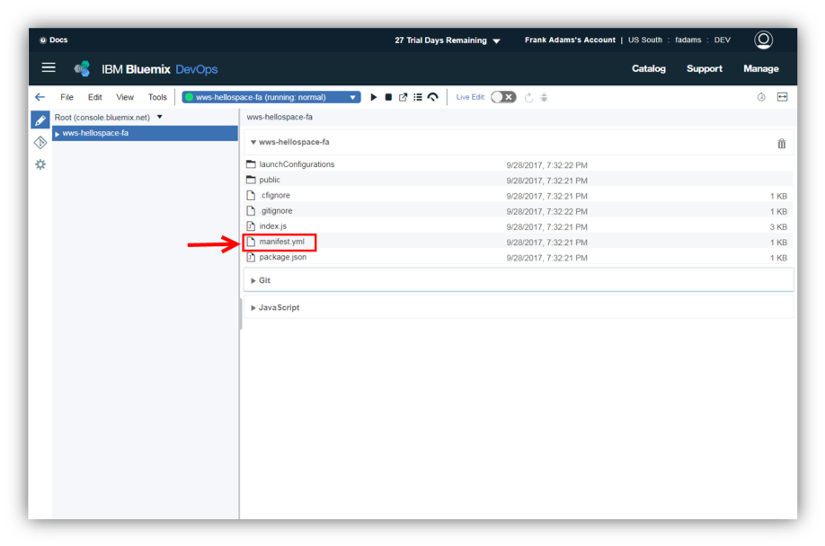
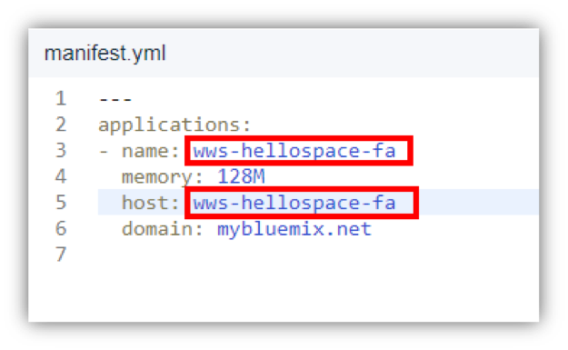
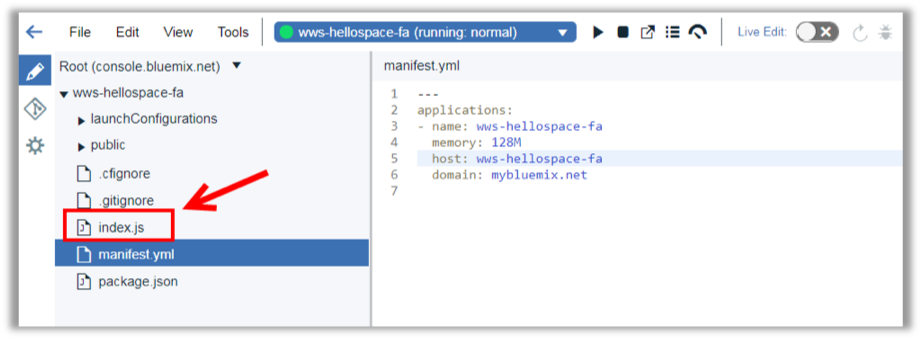
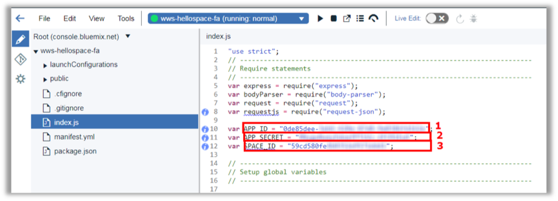

<a name="top"/>

In this section you will see how to edit an application using Eclipse Orion Web IDE on IBM Cloud.

`_1.` Back to the IBM Cloud browser, you should be on the wws-hellospace-xx Toolchain page (if you are not, on the IBM Cloud Dashboard page, open the menu and select DevOps and click on the wws-hellospace-xx app).

`_2.` Here, you will use the Eclipse Orion Web IDE to modify source code. When you edit in the Web IDE, your changes are saved to your cloud workspace. Let’s explore our app code. Open the “**Eclipse Orion Web IDE**”.

`_3.` Here you should see your application. It is a typical Node.JS application with manifest.yml, package.json, index.js and public folder. Open the “**manifest.yml**” file to edit it.

`_4.` Update the “**name**” and “**host**” from manifest.yml to reflect your app name with your initials.

`_5.` And open the “**index.js**” file.

`_6.` On the index.js let’s start changing the “**APP_ID**” (1) with the App Id value of previous step,  the “**APP_SECRET**” (2) with the App Secret value of previous step and the “**SPACE_ID**” (3) with the Sales Team space ID.  

*Nice Job! Now you have your app registered in Watson Work Services. But now you need to create a code for this app. You will do it in the next section.*

 
[Back to Top](#top)  
