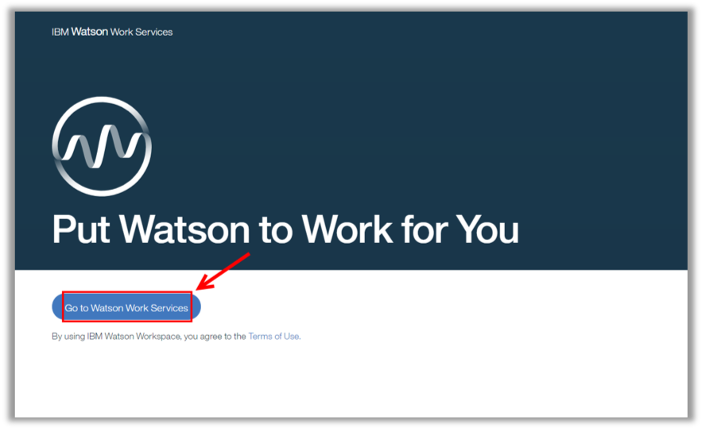
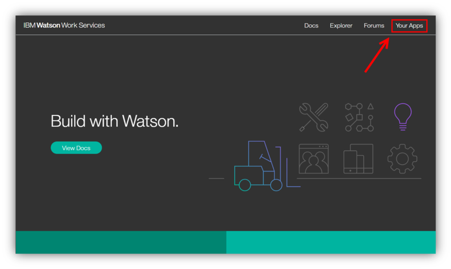
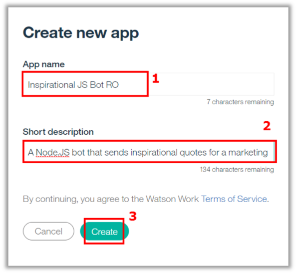
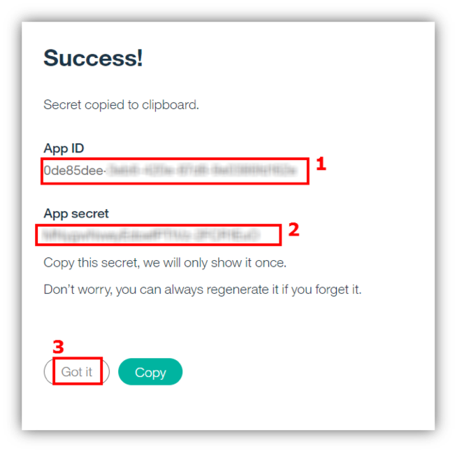

<a name="top"/>

In this section you will see how to edit an application using Eclipse Orion Web IDE on IBM Cloud.

`_1.` Back to the IBM Cloud browser, you should be on the wws-hellospace-xx Toolchain page (if you are not, on the IBM Cloud Dashboard page, open the menu and select DevOps and click on the wws-hellospace-xx app).

`_2.` On the IBM Watson Work Services page, click “**Go to Watson Work Services**”.

`_3.` On the Developer page, click “**Your Apps**”.

`_4.` On “Your Apps” page, you should see your apps here (if you have one). Let’s create a new app.  Click on “**Create new app**” button.

`_5.` On the “**App name**” enter **“Inspirational JS Bot” + <your initials>** (1). On the “**Short description**”, you are welcome to define a cool description for your first app (2). When completed, click “**Create**” (3).

`_6.` Write down the **App ID** (1) and the **App Secret** (2). Saving the App Secret somewhere is especially important, because you will not be able to view it after closing this dialogue. When done click “**Got it**” (3).

*Nice Job! Now you have your app registered in Watson Work Services. But now you need to create a code for this app. You will do it in the next section.*

 
[Back to Top](#top)  
