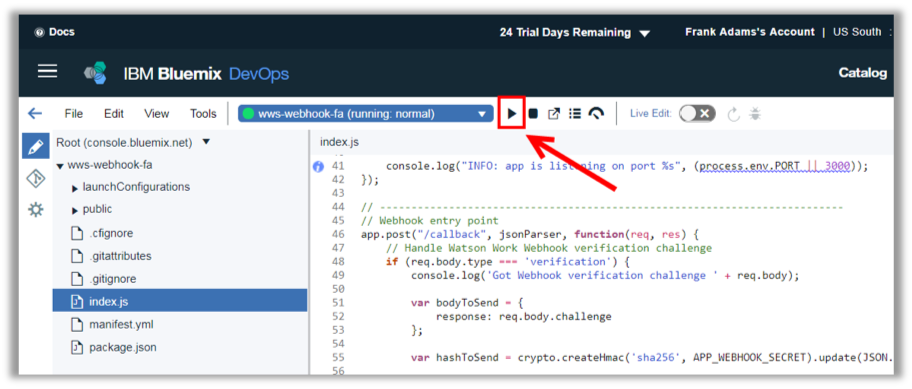
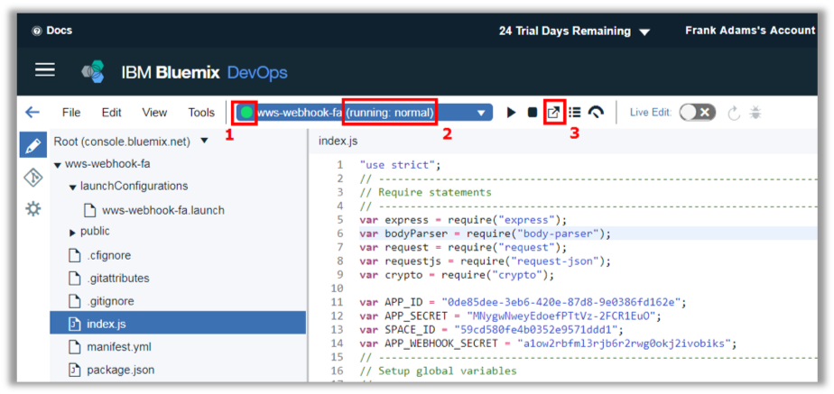
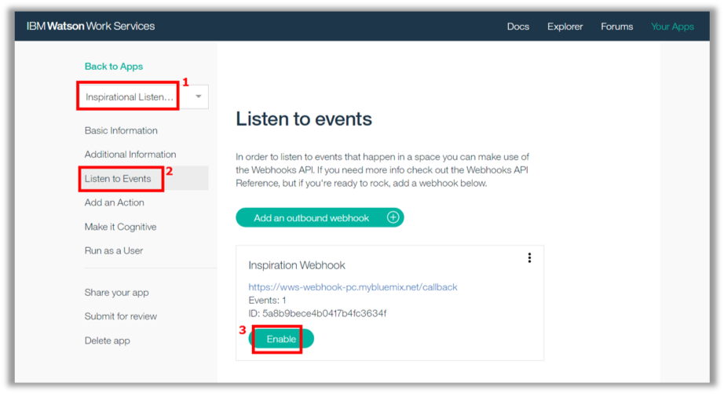
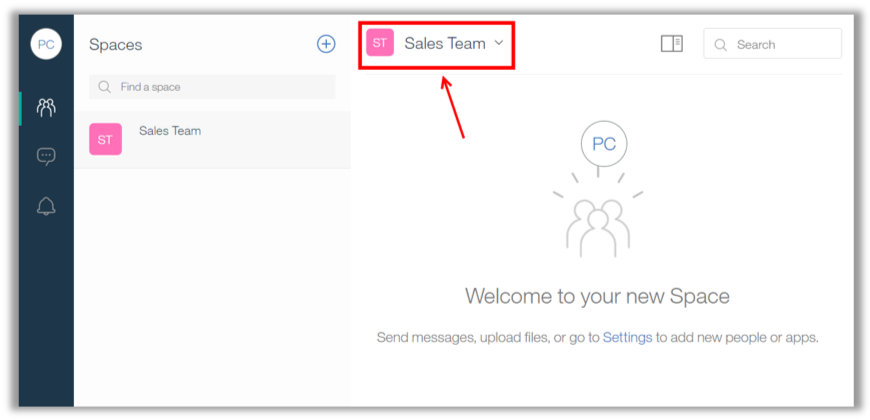
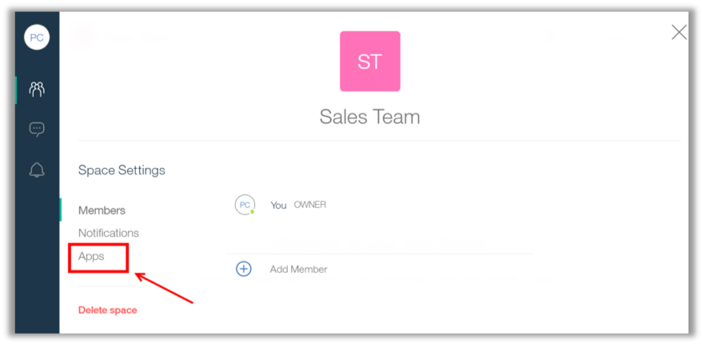
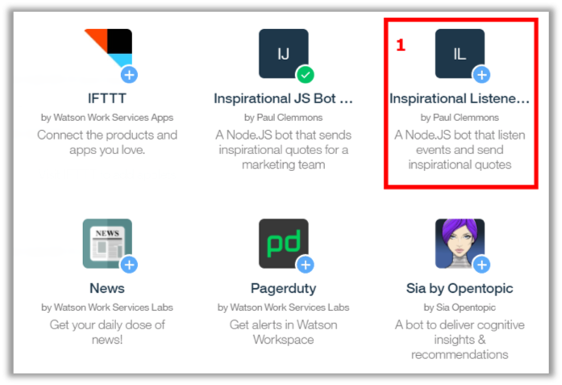
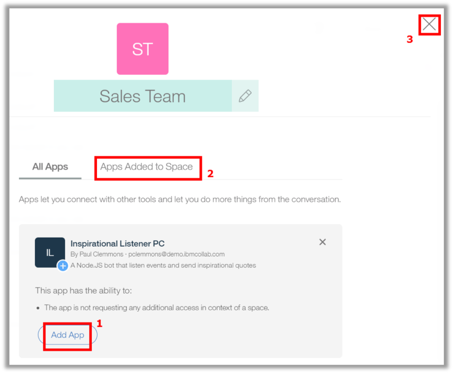
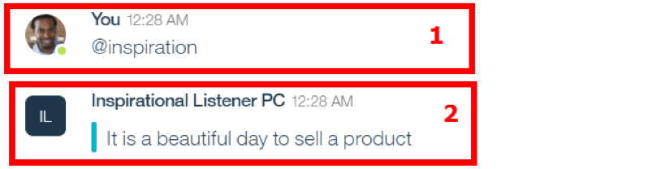

<a name="top"/>

In this section you will see how to deploy, run and test your new application in IBM Cloud DevOps Environment.

`_1.` Now you just need to deploy your application. Click on “**Deploy**” button.

`_2.` When ready, you should see the green circle again (1) and the running information (2).
Click on the “**Open the Deployed App**” button (3).

`_3.` Great Work! Here you see the index.html page (if you completed the lab #1, this index.html is exactly the same of the notification app).

`_4.` Back to the Work Services Developers page, on the “**Inspirational Listener**” page (1), open the “**Listen to Events**” page (2). Here you should see the “Inspiration Webhook”, click on the “**Enable**” button (3).

`_5.` Before we submit the message to test our listener app, let’s add the app in the “Sales Team” space. Open the Workspace browser tab again, and the “Sales Team” space should be open (if not, please open it).

`_6.` On “Sales Team” space click on the “**Space Settings**” (you just need to click on the space’s name).

`_7.` Click “**Apps**”.

`_8.` Scroll down and click on your “**Inspirational Listener**” (1).

`_9.` Then click on “**Add App**” button (2). If you completed any other mini-lab, you should have some other inspirational application on the page. To avoid conflict you should remove the other apps first, you just need to open the “Apps Added to Space” and remove the other apps created for other mini-labs. When done, **close** the Space settings dialog.

`_10.` Now we are ready to test it. On the “Sales Team” space, submit the message “**@inspiration**” (1). Check the **replied message** from the “Inspirational Listener” application (2).

*Congratulations! Your app is almost done. Let’s change the hard coded message, to invoke an external REST service.*

 
[Back to Top](#top)  
