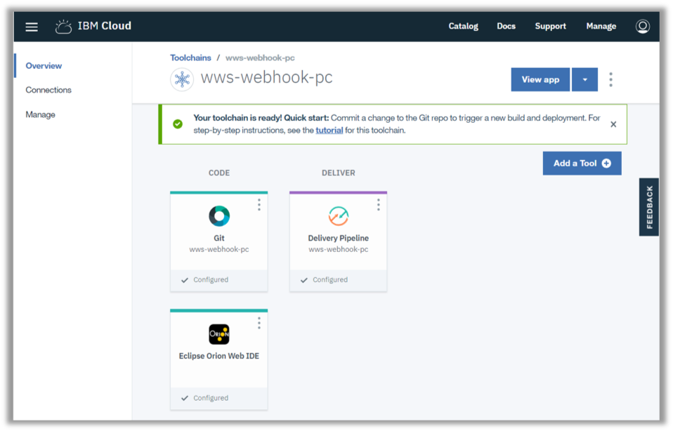
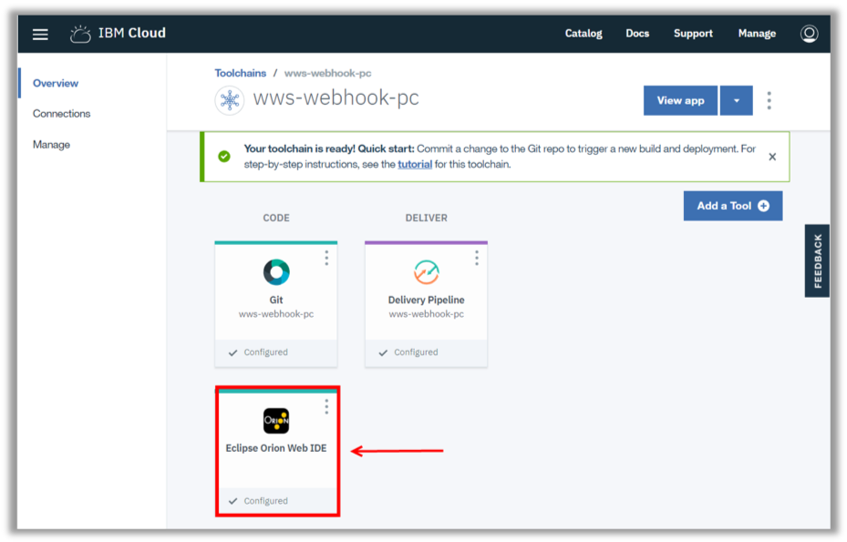
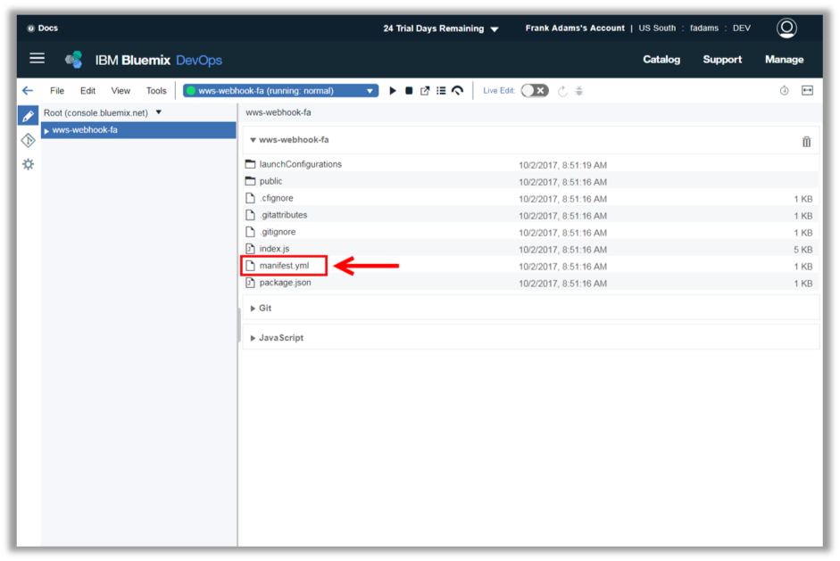
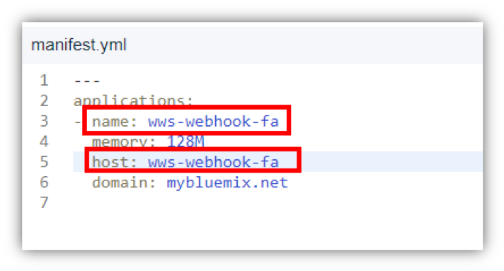
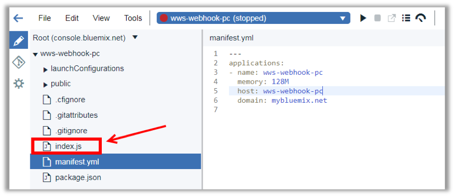
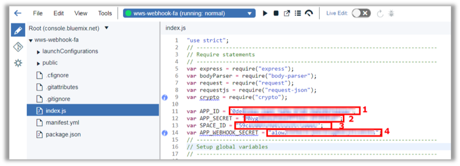
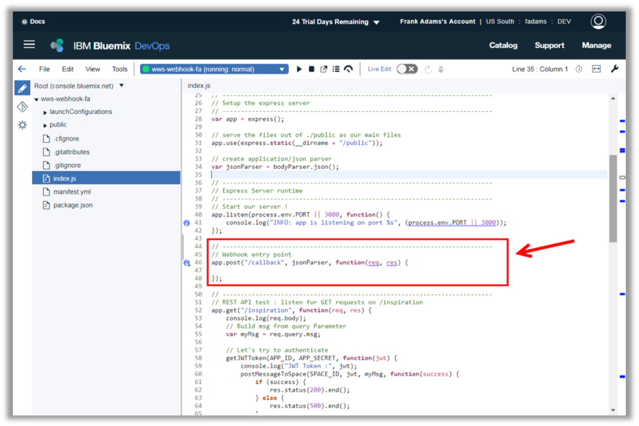
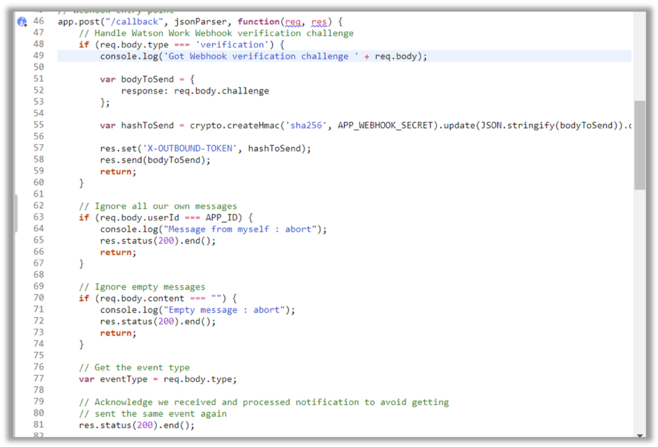

<a name="top"/>

In this section you will see how to edit an application using Eclipse Orion Web IDE on IBM Cloud.

`_1.` Back to the IBM Cloud browser, you should be on the wws-webhook-XX Toolchain page (if you are not, on the IBM Cloud Dashboard page, open the menu and select DevOps and click on the wws-webhook-XX app).


`_2.` Here, you will use the Eclipse Orion Web IDE to modify source code. When you edit in the Web IDE, your changes are saved to your cloud workspace. Let’s explore our app code. Open the “**Eclipse Orion Web IDE**”.


`_3.` Here you should see your application. It is a typical Node.JS application with manifest.yml, package.json, index.js and public folder. Open the “**manifest.yml**” file to edit it.


`_4.` Update the “**name**” and “**host**” from manifest.yml to reflect your app name with your initials.


`_5.` And open the “**index.js**” file.


`_6.` On the index.js let’s start changing the “**APP_ID**” (1) with the App Id value of previous step,  the “**APP_SECRET**” (2) with the App Secret value of previous step and the “**SPACE_ID**” (3) with the Sales Team space ID.  


`_7.` Let’s analyze the code of the app. This app is exactly the same app of the lab #1, please see the Notification lab for more details about the app skeleton). The only big difference here is: you need a callback function to manage the events.  So far, the callback function is empty (see the picture below).


`_8.` Let’s update the app.post function. Update the callback function with the code below:
```
// Handle Watson Work Webhook verification challenge
    if (req.body.type === 'verification') {
        console.log('Got Webhook verification challenge ' + req.body);

        var bodyToSend = {
            response: req.body.challenge
        };

        var hashToSend = crypto.createHmac('sha256', APP_WEBHOOK_SECRET).update(JSON.stringify(bodyToSend)).digest('hex');

        res.set('X-OUTBOUND-TOKEN', hashToSend);
        res.send(bodyToSend);
        return;
    }

    // Ignore all our own messages
    if (req.body.userId === APP_ID) {
        console.log("Message from myself : abort");
        res.status(200).end();
        return;
    }

    // Ignore empty messages
    if (req.body.content === "") {
        console.log("Empty message : abort");
        res.status(200).end();
        return;
    }

    // Get the event type
    var eventType = req.body.type;

	// Get the spaceId
    var spaceId = req.body.spaceId;

    // Acknowledge we received and processed notification to avoid getting
    // sent the same event again
    res.status(200).end();

    // Act only on the events we need
    if (eventType === "message-annotation-added") {
        console.log("Annotation Message received.");
        return;
    }
    if (eventType === "message-created") {
        console.log("Message Created received.");
		if (req.body.content.substring(0, 12) === "@inspiration") {
			getJWTToken(APP_ID, APP_SECRET, function(jwt) {
				console.log("JWT Token :", jwt);
				var msg = "It is a beautiful day to sell a product";
				// And post it back
				postMessageToSpace(spaceId, jwt, msg, function(success) {
					return;
				})
			})
		}
        return;
    }

    // We don't do anything else, so return.
    console.log("INFO: Skipping unwanted eventType: " + eventType);
    return;
```  

The first part handles the webhook verification call. The second part ignores all messages from this app and all empty messages.
<br/>
Next it verifies the type of the event.  Right now this app is only receiving “message-created” events, but it is ready for others too. And at the end, it verifies if the message starts with “@inspiration”, then replies the inspiration message to space.


<br/>
[Back to Top](#top)  
