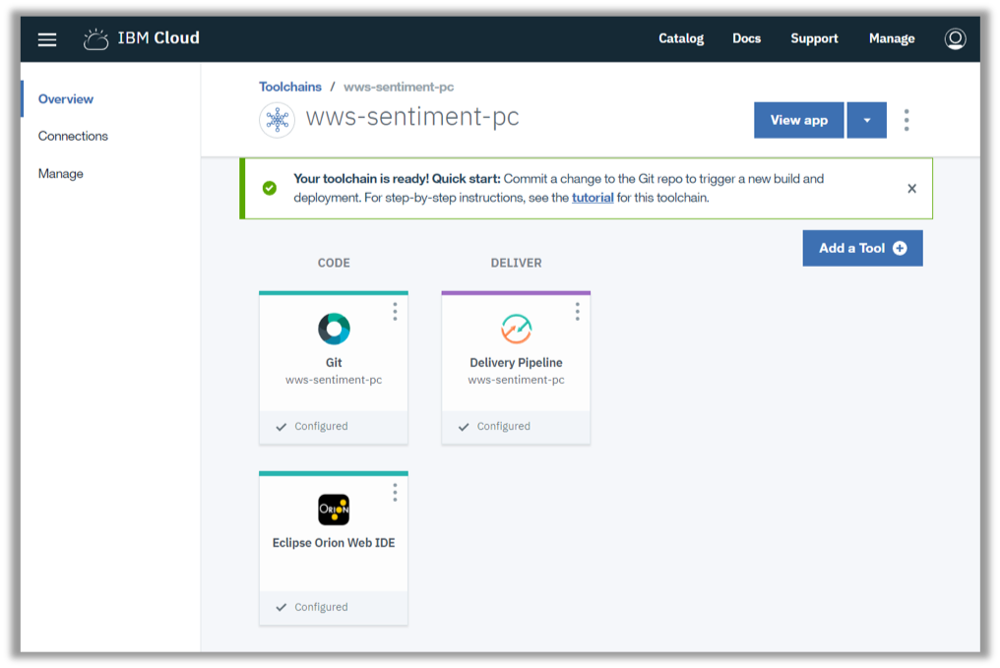
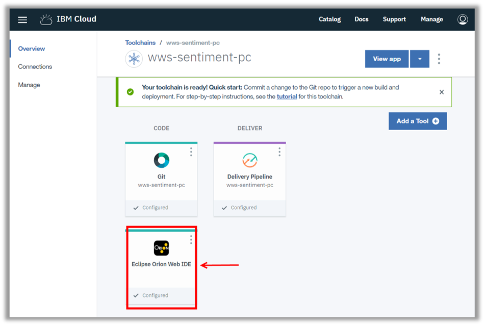
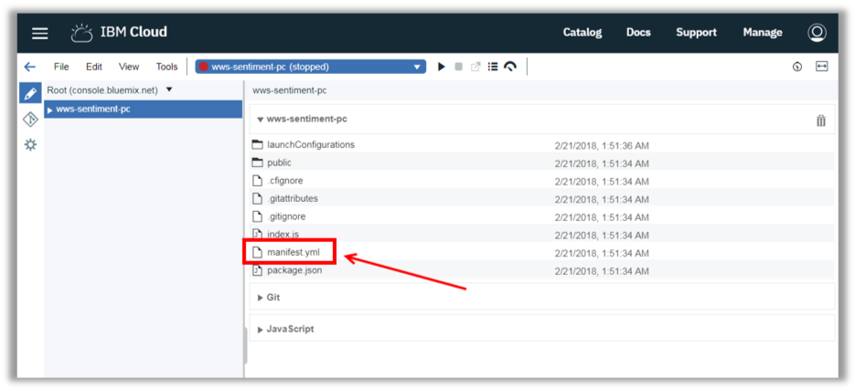
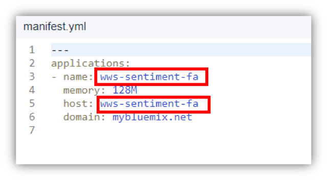
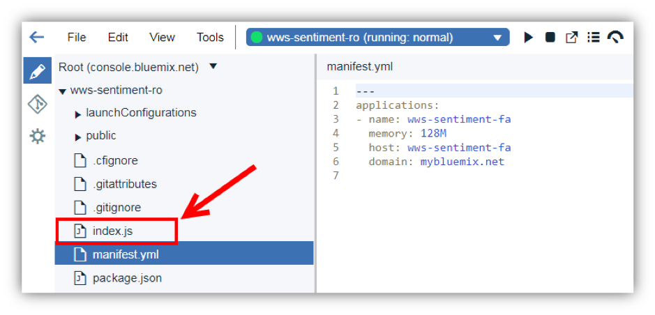
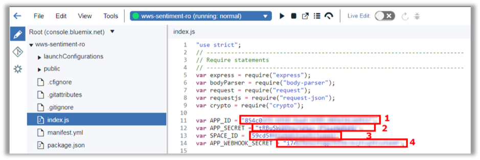
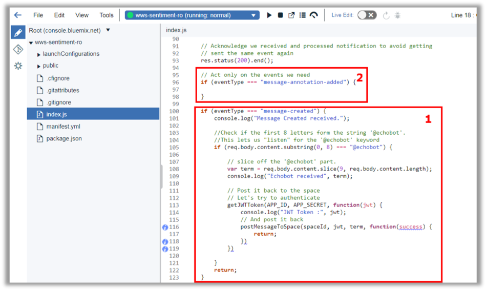
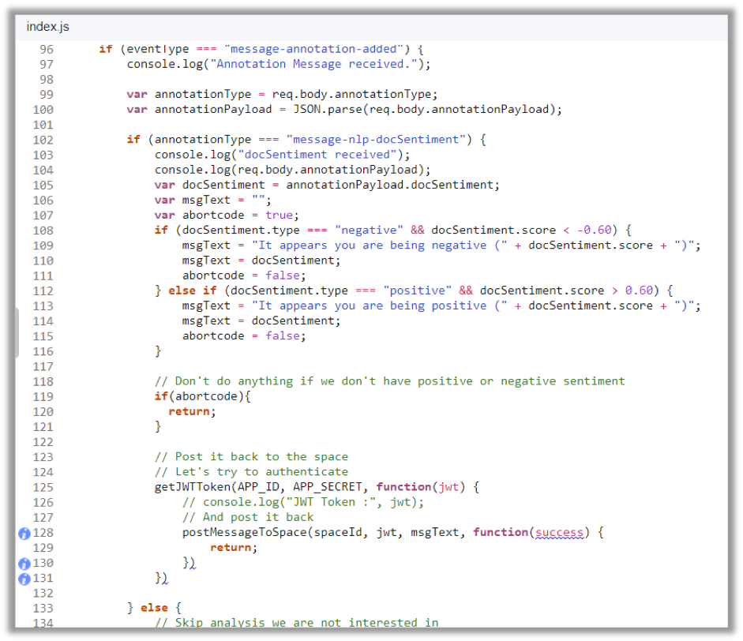

<a name="top"/>

In this section you will see how to edit an application using Eclipse Orion Web IDE on IBM Cloud.

`_1.` Back to the IBM Cloud browser, you should be on the wws-sentiment-XX Toolchain page (if you are not, on the IBM Cloud Dashboard page, open the menu and select DevOps and click on the wws-sentiment-XX app).


`_2.` Here, you will use the Eclipse Orion Web IDE to modify source code. When you edit in the Web IDE, your changes are saved to your cloud workspace. Let’s explore our app code. Open the “**Eclipse Orion Web IDE**”.


`_3.` Here you should see your application. It is a typical Node.JS application with manifest.yml, package.json, index.js and public folder. Open the “**manifest.yml**” file to edit it.


`_4.` Update the “**name**” and “**host**” from manifest.yml to reflect your app name with your initials.


`_5.` And open the “**index.js**” file.


`_6.` On the index.js let’s start changing the “**APP_ID**” (1) with the App Id value of previous step,  the “**APP_SECRET**” (2) with the App Secret value of previous step and the “**SPACE_ID**” (3) with the Sales Team space ID. Change the **APP_WEBHOOK_SECRET** (4) with the “Inspiration Webhook” Secret (see previous section).  


`_7.` Let’s analyze the code of the app. This app is very similar of App of the mini-lab #2. The difference here is: this app will echo the user message when the user type “@echobot + message” (1). Next step you will include more logic to analyze sentiment analyzes from Watson.  So far, the “**message-annotation-added**” code is empty (2).


`_8.` Update the “message-annotation-added” “if” (between the curly brackets) with the code available below:
```
console.log("Annotation Message received.");

var annotationType = req.body.annotationType;
var annotationPayload = JSON.parse(req.body.annotationPayload);

if (annotationType === "message-nlp-docSentiment") {
    console.log("docSentiment received");
    console.log(req.body.annotationPayload);
    var docSentiment = annotationPayload.docSentiment;
    var msgText = "";
    var abortcode = true;
    if (docSentiment.type === "negative" && docSentiment.score < -0.60) {
        msgText = "It appears you are being negative (" + docSentiment.score + ")";
        abortcode = false;
    } else if (docSentiment.type === "positive" && docSentiment.score > 0.60) {
        msgText = "It appears you are being positive (" + docSentiment.score + ")";
        abortcode = false;
    }

    // Don't do anything if we don't have positive or negative sentiment
    if(abortcode){
        return;
    }

    // Post it back to the space
    // Let's try to authenticate
    getJWTToken(APP_ID, APP_SECRET, function(jwt) {
    // And post it back
      postMessageToSpace(spaceId, jwt, msgText, function(success) {
        return;
      });
    });

    } else {
      // Skip analysis we are not interested in
      return;
    }

return;
```  

The first part verifies the annotationType is a “sentiment”. If true the code will send a specific message to the space indicating if the sentiment is negative or positive along with the sentiment Score.
<br/>
Here the message/scenario is simple, but you can use the sentiment annotation to escalate a customer support based on user’s message analysis


<br/>
[Back to Top](#top)  
