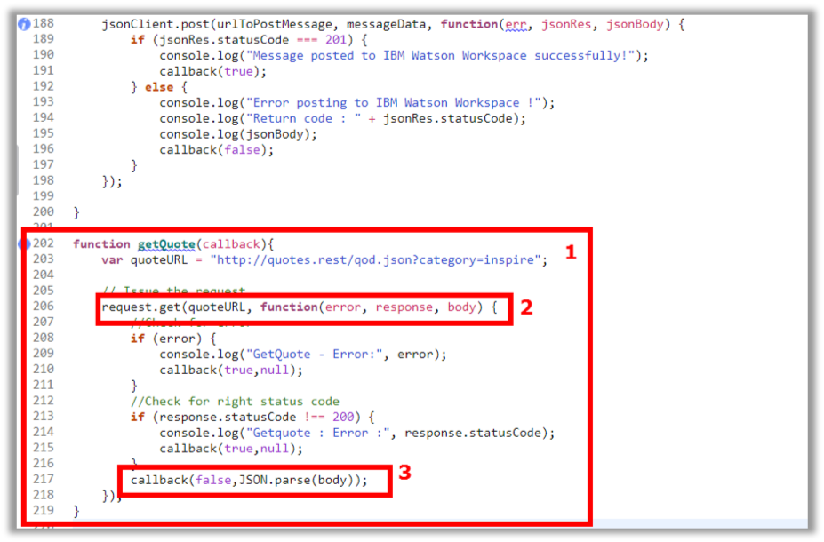
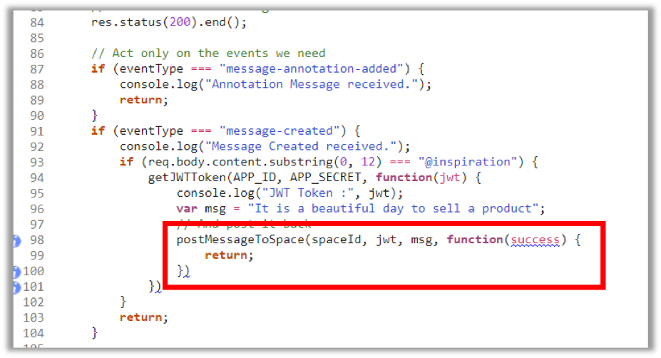
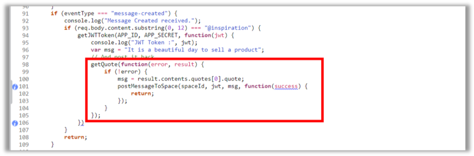
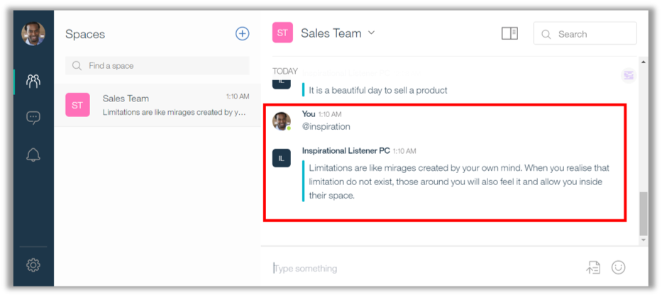

<a name="top"/>

In this section, you will learn how to improve your code to invoke external Rest Services. Here you will use the public Quote Rest API from TheySaidSo, more information available on <a href="https://theysaidso.com" target="blank">https://theysaidso.com</a>. They have a huge collection of quotes in their database, and you will access the quote of the day for a specific category, based in the user message. Let’s do it!

`_1.` Go back to the IBM Cloud browser tab, and go to the end of the “index.js” file and insert the code of the **getQuote** (1) function:
```
function getQuote(callback){
	var quoteURL = "http://quotes.rest/qod.json?category=inspire";

	// Issue the request
  	request.get(quoteURL, function(error, response, body) {
  		//Check for error
    	if (error) {
      		console.log("GetQuote - Error:", error);
			callback(true,null);
    	}
    	//Check for right status code
    	if (response.statusCode !== 200) {
      		console.log("Getquote : Error :", response.statusCode);
      		callback(true,null);
    	}
    	callback(false,JSON.parse(body));
	});
}
```
Let’s analyze the code! This code is a simple GET Request (2) for the Quote Rest API to get the quote of the day of the category “inspire”. At the end, the body parsed json is returned for the callback function (3). It is really simple!!!


`_2.` Now, let’s go back to the app.post code. On the “eventType” equals “message-created”, delete the postMessageToSpace call (see the picture below).


`_3.` As replacement of the postMessageToSpace, insert the code below:
```
getQuote(function(error, result) {
     if (!error) {
         msg = result.contents.quotes[0].quote;
	 postMessageToSpace(spaceId, jwt, msg, function(success) {
	 	return;
	 });
     }
});
```

`_4.` Here you are only calling the new getQuote function to call the Quote REST API, and you are getting the quote json value and setting the message to be post on the space. Please ident your code, to look like the code below:


`_5.` Great! Now you are ready. Your code is sending the quote received from the Quote REST API, instead of the message received in the Query Parameter. Let’s test it! Click on “**Deploy**” button again (1). If you see a message asking if you want to re-deploy your message, please click **OK**.


`_6.` Now we are ready to test it. Go back to the Workspace browser tab. On the “Sales Team” space, submit again the message “**@inspiration**”. Check the **replied message** from the “Inspirational Listener” application. You should have a real inspirational quote that came from Quote Rest API.
<p>
<span class="label label-warning">Note</span>
Your quote should be different of the picture bellow, since the API provides a different quote per day
</p>


If you want to change the category of the quote, you are welcome. The API provides sport, fun, life, etc. You just need to change the category query parameter of the “queryURL var” of the “getQuote” function, and redeploy your app.

*Congratulations! You learned how to create a Watson Work Services listener app that receives events and sends message to a space using Node.JS and external REST service. Next lab, you will see how to leverage the Watson Annotation of a message to add some cognitive features in your app.*


<br/>
[Back to Top](#top)  
