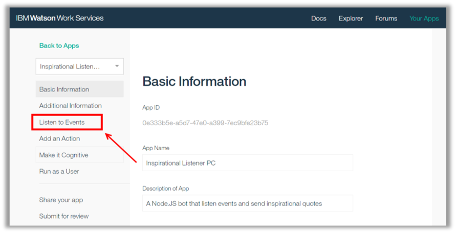
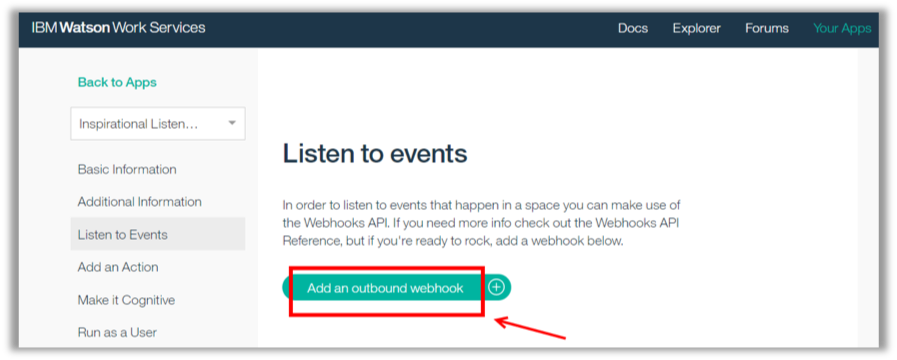
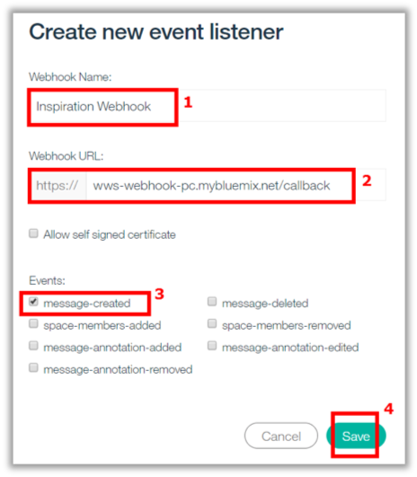
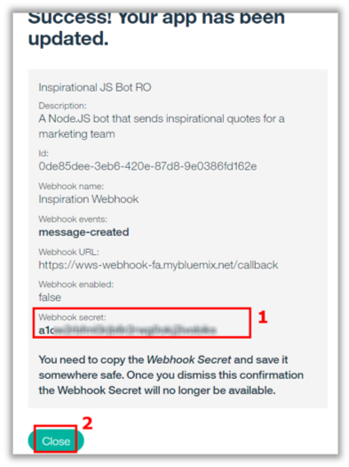

<a name="top"/>

In this section you will see how to listen to events. Here you need to configure your app to listens “message-created” event, let’s see how to do it!

`_1.` On the App page, click on “**Listen to Events**” page.

`_2.` Click “**Add an outbound webhook**”.

`_3.` On the “Create new event listener” dialog, enter “**Inspiration Webhook**” (1) as the Webhook Name, enter “**wws-webhook-**`<yourinitials>`**.mybluemix.net/callback**” (2), and select the “**message-created**” event (3)

Note
here you are able to select the list of events that you want to listen to.  

When done, click “**Save**” (4).

`_4.` Great job! Your webhook is ready. You need to copy the “**Webhook Secret**” (1) and save it somewhere safe. Once you dismiss this confirmation the Webhook Secret will no longer be available. Then, click “**Close**”.

 
[Back to Top](#top)  
