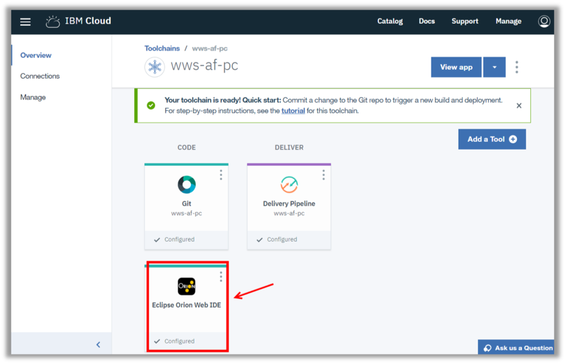

<a name="top"/>

In this section you will see how to edit an application using Eclipse Orion Web IDE on IBM Cloud.

`_1.` Back to the IBM Cloud browser, you should be on the wws-af-XX Toolchain page. You will use the Eclipse Orion Web IDE to modify source code. When you edit in the Web IDE, your changes are saved to your cloud workspace. Let’s explore our app code. Open the “Eclipse Orion Web IDE”.


`_2.` Here you should see your application. It is a typical Node.JS application with manifest.yml, package.json, index.js and public folder. Open the “**manifest.yml**” file to edit it.


`_3.` Update the “**name**” and “**host**” from manifest.yml to reflect your app name with your initials.


`_4.` And open the “**index.js**” file.


`_5.` On the index.js let’s start changing the “**APP_ID**” (1) with the App Id value of previous step,  the “**APP_SECRET**” (2) with the App Secret value of previous step and the “**SPACE_ID**” (3) with the Sales Team space ID. Change the **APP_WEBHOOK_SECRET** (4) with the “Action Webhook” Secret (see previous section).  


`_6.` We are going to analyze the code of the app. Before seeing the code, let’s see the application flow. The chart below shows the macro flow of our new app.

The first step of the process is the end user sends a message in Workspace (1). Because there is an app in this space linked with Watson Conversation, the message is forwarded to Watson Conversation to verify the “Intents” and “Entities” (2).  In our case, if WC identifies the message as an “Inspiration” intent, it will respond with a json to inform the Get_Inspired action (3). This response will be added as a message annotation, and the Workspace will highlight the message to inform a possibleun action (4). Any user in the space is able to click on the message to open the Action Fulfillment bar/dialog (5). When a user clicks on the message, a message annotation of type “actionSelected” is created to inform the cloud app of the click (6). This annotation includes the user, dialog and message ID.  Since the app is listening to message-annotation-created webhook, our cloud app will receive this annotation. Our application will now call a graphQL query to get the entities of the referral message, to get the category of the quote the user is looking for the inspiration(7). As response of the GraphQL query, your cloud app will receive all the message annotation of the referral message, and parse this response to get the category(8). For this lab, the app will return a list of quotes, only for the “Funny” category. In this case, the app will return a Card UI with a list of quotes (9). This card, for the lab simplification purpose, is created directly in the code. However, in a real situation, the information to create the card is consumed by an external service. Workspace will use the card graphQL to generate the card UI to show a list of possible quotes for the “funny” category. In a card, a user is able to share the demo asset information with the space, by clicking the “Share with Space” button (11). As soon as the user clicks on the “Share with Space” button, a new “actionSelected” message annotation is created (12), but now the actionId will be different, with the id of the button. Your cloud app will receive the new annotation, and based on the action ID will post a message in the space with the Demo Asset details (13). Now all users of the space will see the Quote details in the space as a message posted by your app (14).

`_7.` Your cloud app will handle the steps 6 to 9 and 12 to 13. Let’s start to create our app.  
So far, the “if” statement for the (eventType===“message-annotation-added”) is empty.


`_8.` Let’s update the message-annotation-added code. Update the “if” statement with the code below:
```
      var annotationType = req.body.annotationType;
      var annotationPayload = JSON.parse(req.body.annotationPayload);

      // Action fulfillment callback - When user clicks and engages with App
      if (annotationType === "actionSelected") {
  	  var userName = req.body.userName;
        console.log("------- AF -------------------------------");
        console.log("%s clicked on an action link.", userName);

        // Extract the necessary info
        var targetUserId = req.body.userId;
        var conversationId = annotationPayload.conversationId;
        var targetDialogId = annotationPayload.targetDialogId;
        var referralMessageId = annotationPayload.referralMessageId;
        var actionId = annotationPayload.actionId;
        console.log("Action : %s", actionId);
        console.log("Referral Message Id : %s", referralMessageId);

        var gqlmessage = "query getMessage {message(id: \"" + referralMessageId + "\") {annotations}}";
  	    // First click on underlined message
        if (actionId === "Get_Inspired") {
  		      // We first need to get back the annotations of the originating message to get the possible search terms.
            getJWTToken(APP_ID, APP_SECRET, function(accessToken) {
                console.log("getJWTToken OK");
                callGraphQL(accessToken, gqlmessage, function(error, bodyParsed, accessToken) {
                  if (!error) {
                    var msgannotations = bodyParsed.data.message.annotations;

                    // Loop over all the annotations and get the one we need
                    for (var i = 0; i < msgannotations.length; i++) {
                      var ann = JSON.parse(msgannotations[i]);
                      console.log("Annotation Type: "+ann.type);
                      // React on message-focus to catch the expert query
                      if (ann.type === "message-focus") {
                        // Get the lens of the focus
                        var lens = ann.lens;

                        // Only react on lens 'inspiration'
                        if (lens === "inspiration") {
                          console.log("Received Demo Asset Query : " + ann.phrase);

                          var confidence = ann.confidence;
                          var extractedInfo = ann.extractedInfo;
  					      var entities = extractedInfo.entities;
  					      var arrayLength = entities.length;
  					      var category = "";
  					      for (var j = 0; j < arrayLength; j++) {
                            if (entities[j].type === "category"){
                              category = entities[j].text;
                            }
                          }
                          console.log("Confidence: "+confidence+" - Category: "+category);

  					      // Preparing the dialog message
                          var afgraphql1 = "mutation {createTargetedMessage(input: {conversationId: \"" + conversationId + "\" targetUserId: \"" + targetUserId + "\" targetDialogId: \"" + targetDialogId + "\" attachments: [";
                          var afgraphql3 = "]}){successful}}";
                          var afgraphql2 = "";
                          var cardtitle = "";
                          var cardsubtitle = "Inspirational Quotes";
                          var cardtext = "";

                          var carddate = "1500573338000";//"1510093211";
                          var buttontext = "SHARE";
                          var buttonpayload = "SHARE-";

                          if (category === "funny"){
                            console.log("Category is Funny");
                            for (var i = 0; i < 5; i++) {
                              if (i === 0) {
                                cardtitle = "Elbert Hubbard";
                                cardtext = "Do not take life too seriously. You will never get out of it alive.";
                                buttonpayload = "SHARE-FUNNY-00";
                                afgraphql2 += "{type:CARD, cardInput:{type:INFORMATION, informationCardInput: {title: \"" + cardtitle + "\", subtitle: \"" + cardsubtitle + "\", text: \"" + cardtext + "\", date: \"" + carddate + "\", buttons: [{text: \"" + buttontext + "\", payload: \"" + buttonpayload + "\", style: PRIMARY}]}}}";
                              }
                              else {
                                afgraphql2 += ",";
                                if (i===1){
                  								cardtitle = "Reba McEntire";
                  								cardtext = "To succeed in life, you need three things: a wishbone, a backbone and a funny bone.";
                  								buttonpayload = "SHARE-FUNNY-01";
                  								afgraphql2 += "{type:CARD, cardInput:{type:INFORMATION, informationCardInput: {title: \"" + cardtitle + "\", subtitle: \"" + cardsubtitle + "\", text: \"" + cardtext + "\", date: \"" + carddate + "\", buttons: [{text: \"" + buttontext + "\", payload: \"" + buttonpayload + "\", style: PRIMARY}]}}}";
                                } else if (i===2) {
                                  cardtitle = "Margaret Mead";
                                  cardtext = "Always remember that you are absolutely unique. Just like everyone else.";
                                  buttonpayload = "SHARE-FUNNY-02";
                                  afgraphql2 += "{type:CARD, cardInput:{type:INFORMATION, informationCardInput: {title: \"" + cardtitle + "\", subtitle: \"" + cardsubtitle + "\", text: \"" + cardtext + "\", date: \"" + carddate + "\", buttons: [{text: \"" + buttontext + "\", payload: \"" + buttonpayload + "\", style: PRIMARY}]}}}";
                                } else if (i===3) {
                                  cardtitle = "Abraham Lincoln";
                                  cardtext = "No man has a good enough memory to be a successful liar.";
                                  buttonpayload = "SHARE-FUNNY-03";
                                  afgraphql2 += "{type:CARD, cardInput:{type:INFORMATION, informationCardInput: {title: \"" + cardtitle + "\", subtitle: \"" + cardsubtitle + "\", text: \"" + cardtext + "\", date: \"" + carddate + "\", buttons: [{text: \"" + buttontext + "\", payload: \"" + buttonpayload + "\", style: PRIMARY}]}}}";
                                } else if (i===4) {
                                  cardtitle = "Steve Martin";
                                  cardtext = "A day without sunshine is like, you know, night.";
                                  buttonpayload = "SHARE-FUNNY-04";
                                  afgraphql2 += "{type:CARD, cardInput:{type:INFORMATION, informationCardInput: {title: \"" + cardtitle + "\", subtitle: \"" + cardsubtitle + "\", text: \"" + cardtext + "\", date: \"" + carddate + "\", buttons: [{text: \"" + buttontext + "\", payload: \"" + buttonpayload + "\", style: PRIMARY}]}}}";
                                }
                              }
                            }
                            var afgraphql = afgraphql1 + afgraphql2 + afgraphql3;
                            console.log("Calling PostAFMessage");
                            console.log("afgraphql: "+afgraphql);
                            postActionFulfillmentMessage(accessToken, afgraphql, function(err, accessToken) {
                              if (err) {
                                console.log("Unable to post custom message to space.");
                              }
                              return;
                            });
                          }
                        }
                      }
                    }
                  }
                })

            })
          }
          if (actionId.startsWith("SHARE")) {
             // Get the searchwords from the actionId
             var cardID = actionId.slice(6, actionId.length);
             console.log("AF received SHARE for : ", cardID);

             afShare(conversationId, targetUserId, targetDialogId, spaceId, cardID);
          }
        }
```

<p>
<span class="label label-warning">Note</span>
Please, copy between the comment “//Message Annotation Added Code Here” and the “return;” command  
</p>


`_9.` Let’s analyze the code. In the first part, the code is handling the annotationType is “actionSelected” and capturing the user, conversation, targetDialog and referralMessage ID. And based on these ids, it is creating the graphQL query message to retrieve the annotation of the referral Message.


`_10.` On the second part, we are calling the callGraphQL to get the annotations if the actionId === “Get_Inspired” (Watson Conversation identifies that the user is looking for inspirational quotes).  With the response of the GraphQL, the app will part the annotation and get the quote Category (it is an entity of the message-focus annotations in the lens element).


`_11.` On the third part, we will create the Card UI as response of the action. Here if the category is “Funny”, we are creating a mutation GraphQL to generate the Card UI. Each card is a JSON created hard coded here. We are creating a card for five funny quotes.  At the end of this part we execute the graphQL mutation call.


`_12.` We finish this code, with a code to handle actions when a user clicks the “Share with Space” button. All buttons will trigger a “SHARE*” action. Here if the actionID starts with “Share”, we will call the afShare() function.  


`_13.` However, so far this function is empty. Let’s add some code for this function on the next step.


`_14.` Update the “afShare” function with the code below:
```
    var quoteName = "";
    var quoteDescription = "";

    if (cardId==="FUNNY-00"){
      quoteName = "Elbert Hubbard";
      quoteDescription = "Do not take life too seriously. You will never get out of it alive.";
    } else if  (cardId==="FUNNY-01"){
      quoteName = "Reba McEntire";
      quoteDescription = "This asset will help you to be prepared for a Conversation with a Customer.";
    } else if  (cardId==="FUNNY-02"){
      quoteName = "Margaret Mead";
      quoteDescription = "Always remember that you are absolutely unique. Just like everyone else.";
    } else if  (cardId==="FUNNY-03"){
      quoteName = "Abraham Lincoln";
      quoteDescription = "No man has a good enough memory to be a successful liar.";
    } else if  (cardId==="FUNNY-04"){
      quoteName = "Steve Martin";
      quoteDescription = "A day without sunshine is like, you know, night.";
    }
    var afgraphql1 = "mutation {createTargetedMessage(input: {conversationId: \"" + conversationId + "\" targetUserId: \"" + targetUserId + "\" targetDialogId: \"" + targetDialogId + "\" annotations: [{genericAnnotation: {title: \"Shared quote details !\" text: \"I've shared the details of the quote - " + quoteName + " - with the space.\" buttons: [";
    var afgraphql2 = "]}}]}){successful}}";

    var afgraphql = afgraphql1 + afgraphql2;

    // preparing the share message
    var messageName = "You requested details about a quote ";

    var demomessage = "Here are the details : " + textBreak;
    demomessage += "*Author* : " + quoteName + textBreak;
    demomessage += "*Quote* : " + quoteDescription + textBreak;
    demomessage += "*Quote Page* : [BrainyQuote](https://www.brainyquote.com/topics/funny)";

    var messageTitle = "";
    if (cardId.startsWith("FUNNY")){
      messageTitle = "Funny Quotes";
    }

    // Send the dialog message
      getJWTToken(APP_ID, APP_SECRET, function(accessToken) {

        // Building the message to send to the space.
        var messageData = {
          type: "appMessage",
          version: 1.0,
          annotations: [
            {
              type: "generic",
              version: 1.0,
              color: "#0543D5",
              title: messageTitle,
              text: demomessage,
              actor: {
                name: messageName,
                avatar: "",
                url: ""
              }
            }
          ]
        };

        postCustomMessageToSpace(accessToken, spaceId, messageData, function(err, accessToken) {
          if (err) {
            console.log("Unable to post custom message to space. No quotes shared.");
          }
        });

        postActionFulfillmentMessage(accessToken, afgraphql, function(err, accessToken) {
          return;
        });

    });
```

<p>
<span class="label label-warning">Note</span>
please, copy the code below the comment: “// AFShare code here”  
</p>


`_15.` The rest of the code is ready. But just for your information we have some generic functions to post message to a space, to call graphQL and post Action Fulfillment message.


`_16.` Now you just need to deploy your application. Click on “**Deploy**” button.


`_17.` Back to the Work Services Developers page, on the “**Inspiration Action**” page (1), open the “**Listen to Events**” page (2). Here you should see the “Action Webhook”, click on the “**Enable**” button (3).


`_18.` Now we are ready to test it. Go back to the **Workspace** page. On the “Sales Team” space, submit the message “**What is the funny quote of the day?**” (1).  And now you should see an underline on the message, that is the way Workspace inform you that there is an action available.


`_19.` Click to open the “**Inspirational Action ...**” action dialog.


`_20.` Now you should see the Card UI showing the different funny quotes. Click on any “**Share**” button.


`_21.` Now you should see two messages: one in the space with the demo assets details (1), and another in the Action Fulfillment UI to inform the user the details were shared on the space.


*Congratulations! You have created an Action Fulfillment application. Now you are ready to create different types of cognitives apps for Watson Workspace. Enjoy it!*

<br/>
[Back to Top](#top)  
