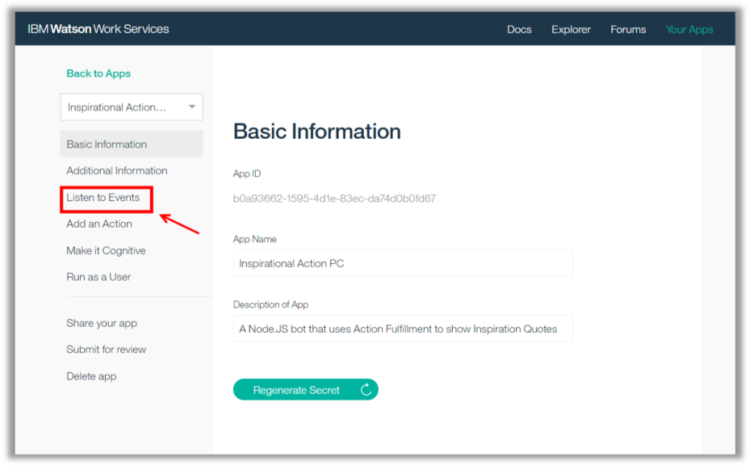
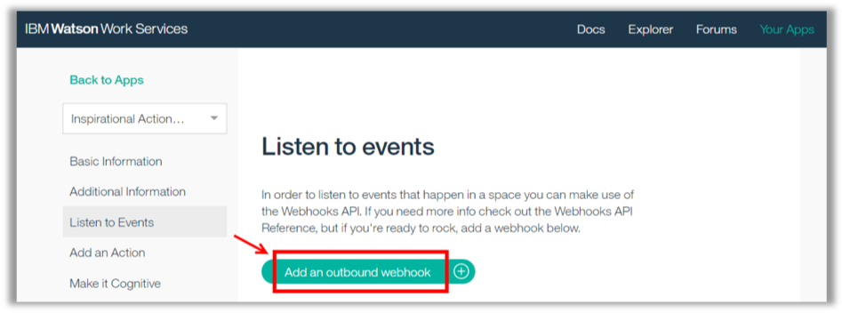
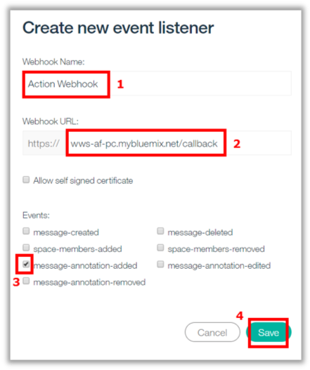
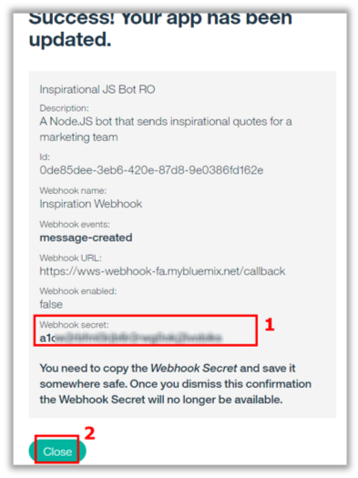

<a name="top"/>

Now we need to enable our Work Services app to listen to events. Here you need to configure your app to listen “message-annotation-added” events. When a user click in an action, your app will receive an annotation about this click, you will see more details later. Let’s see how to listen to event!

`_1.` Back to the Watson Work Services “Your Apps” page, open the “**Inspirational Action**” app and click on “**Listen to Events**” page.

`_2.` Click “**Add an outbound webhook**”.

`_3.` On the “Create new event listener” dialog, enter “**Action Webhook**” (1) as the Webhook Name, enter “**wws-af-**`<yourinitials>`**.mybluemix.net/callback**” (2), and select the “**message-annotation-added**” event (3). When done, click “**Save**” (4).

`_4.` Great job! Your webhook is ready. You need to copy the “**Webhook Secret**” (1) and save it somewhere safe. Once you dismiss this confirmation the Webhook Secret will no longer be available. Then, click “**Close**”.

 
[Back to Top](#top)  
