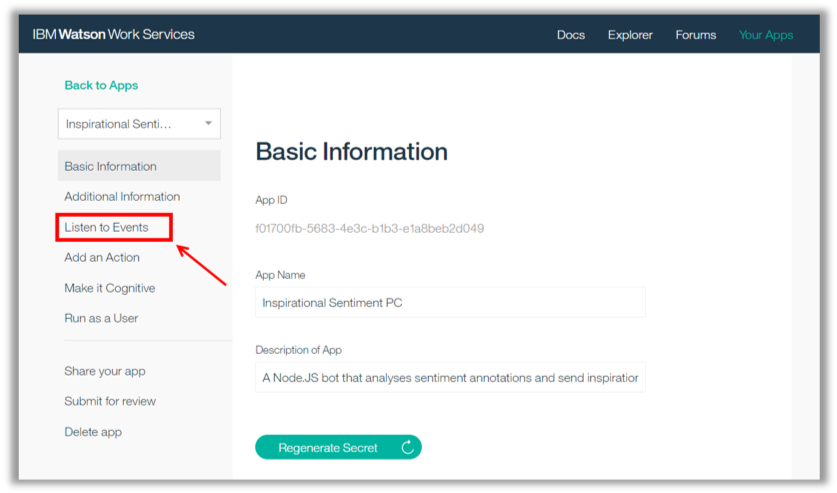
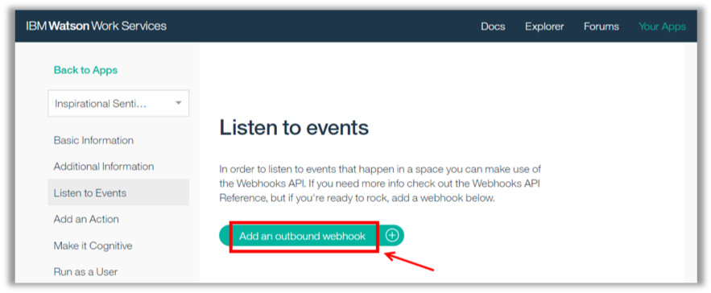
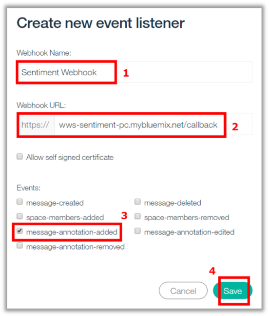

<a name="top"/>

In this section you will see how to listen to events. Here you need to configure your app to listen “message-annotation-added” event. When a new message is added in a space, Watson Workspace invoke multiple Watson services to do a Cognitive Analyses of this message. Here you don’t need to do anything (no API call is necessary). Out of the box, Workspace invoke Watson services, and this analyze is added as an “annotation of the message”. As a developer, you are able to define if you want to receive this cognitive analysis (annotations). Let’s see how to do it!

`_1.` On the App page, click on “**Listen to Events**” page.

`_2.` Click “**Add an outbound webhook**”.

`_3.` On the “Create new event listener” dialog, enter “**Sentiment Webhook**” (1) as the Webhook Name, enter “**wws-sentiment-**`<yourinitials>`**.mybluemix.net/callback**” (2), and select the “**message-annotation-added**” event (3). When done, click “**Save**” (4).

`_4.` Great job! Your webhook is ready. You need to copy the “**Webhook Secret**” (1) and save it somewhere safe. Once you dismiss this confirmation the Webhook Secret will no longer be available. Then, click “**Close**”.

 
[Back to Top](#top)  
