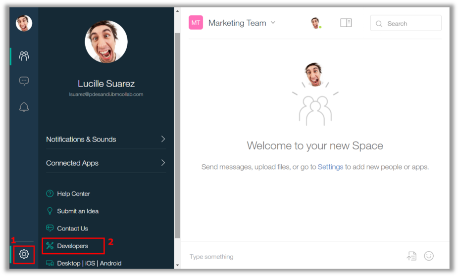
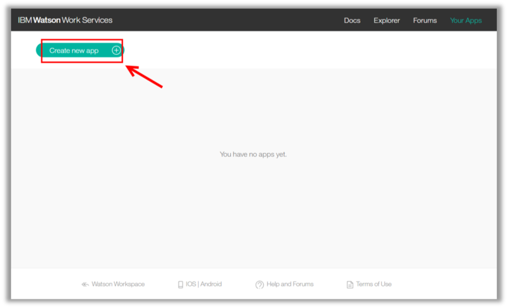
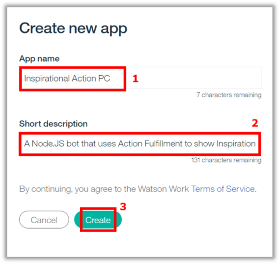
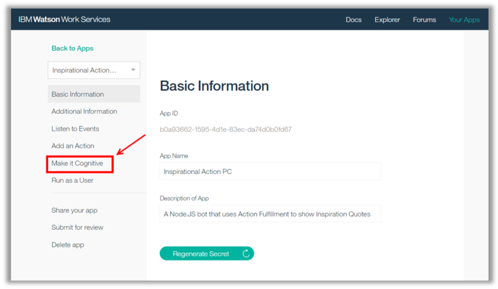
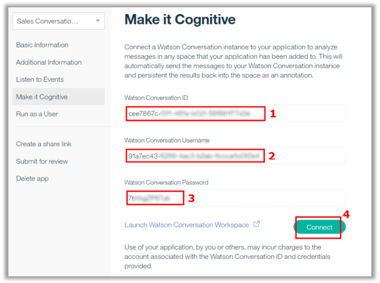
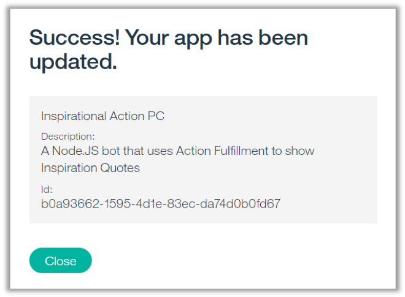

<a name="top"/>

Watson Work Services provides you with a cloud based platform for building collaboration apps with the power of Watson. You’ll find easy to use APIs that go beyond just collaboration, they are infused with the insight and understanding only Watson can provide. Watson Work Services can be used to develop apps for Watson Workspace, IBM's team messaging application, as well as other collaboration, social networking and industry domain tools.

Now, let’s see how to register an Application in the Watson Work Services Developers Page.

`_1.` Back to the Workspace page browser tab, click on the “**User Settings**” button (1) and open the “**Developers**” page (2).

`_2.` On the IBM Watson Work Services page, click “**Go to Watson Work Services**”.

`_3.` On the Developer page, click “**Your Apps**”.

`_4.` On “Your Apps” page, you should see your apps here (if you have one). Let’s create a new app.  Click on “**Create new app**” button.

`_5.` On the “**App name**” enter **“Inspirational Action +”** + `<your initials>` (1). On the “**Short description**”, you are welcome to define a cool description for your first app (2). When completed, click “**Create**” (3).

`_6.` Write down the **App ID** (1) and the **App Secret** (2). Saving the App Secret somewhere is especially important, because you will not be able to view it after closing this dialogue. When done click “**Got it**” (3).

*Nice Job! Now you have your app registered in Watson Work Services. But now let’s see how to integrate the Watson Assistant workspace.*

`_7.` Here is the most important part: how to enable your application to use the Watson Conversation flow to understand your Conversation. It is really simple: click “**Make it Cognitive**”.

`_8.` On the “Make it Cognitive” page. Enter the “**Watson Conversation ID**” (1), enter the “**Watson Conversation Username**” (2) and “**Watson Conversation Password**” (3). When completed, click “**Connect**” (4)

`_9.` You should receive a “**Success**” message. Click “**Close**”.

*Great! Next section, you will test the Watson Assistant integration.*

 
[Back to Top](#top)  
