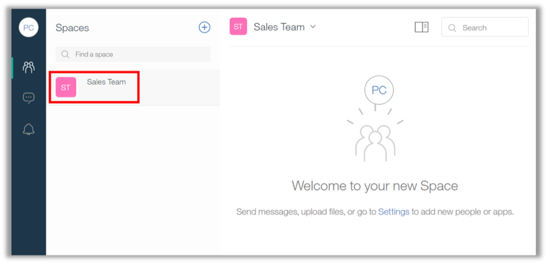
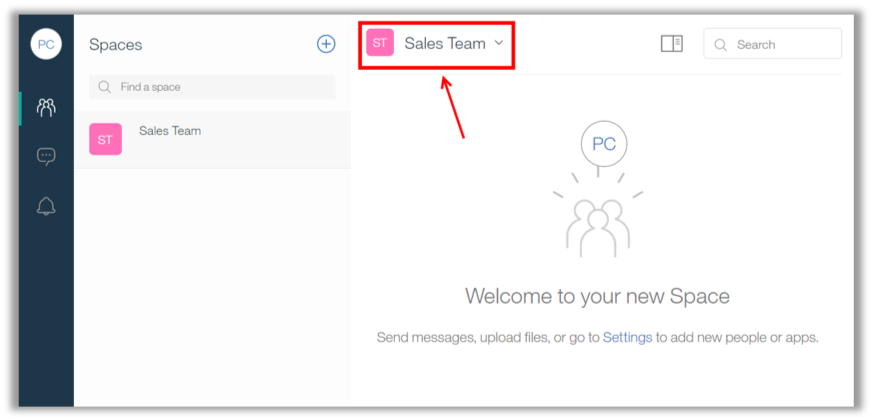
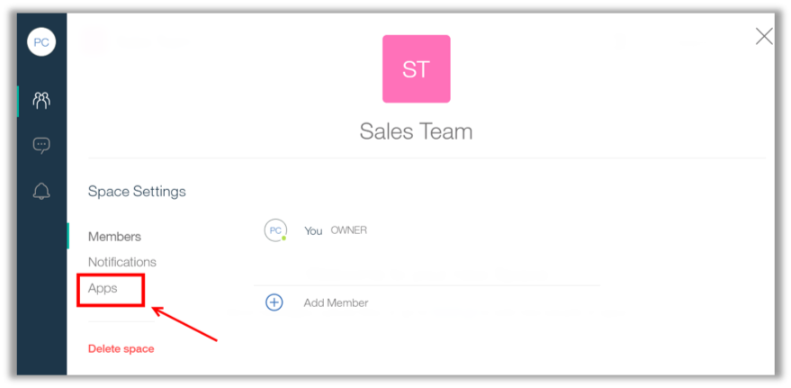
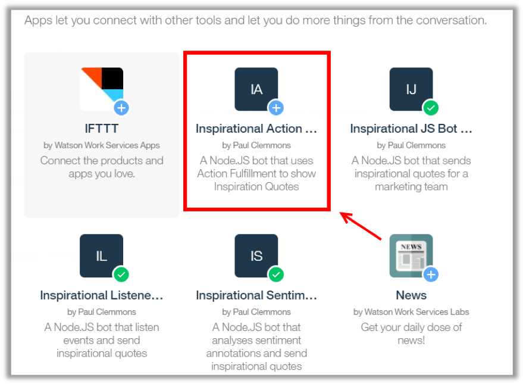
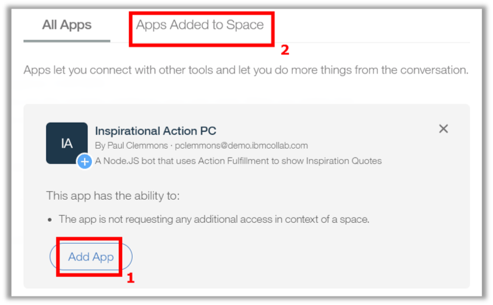
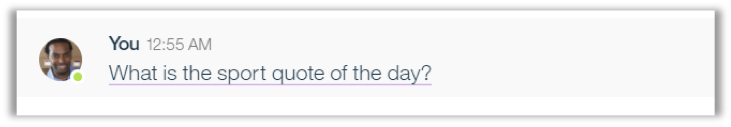
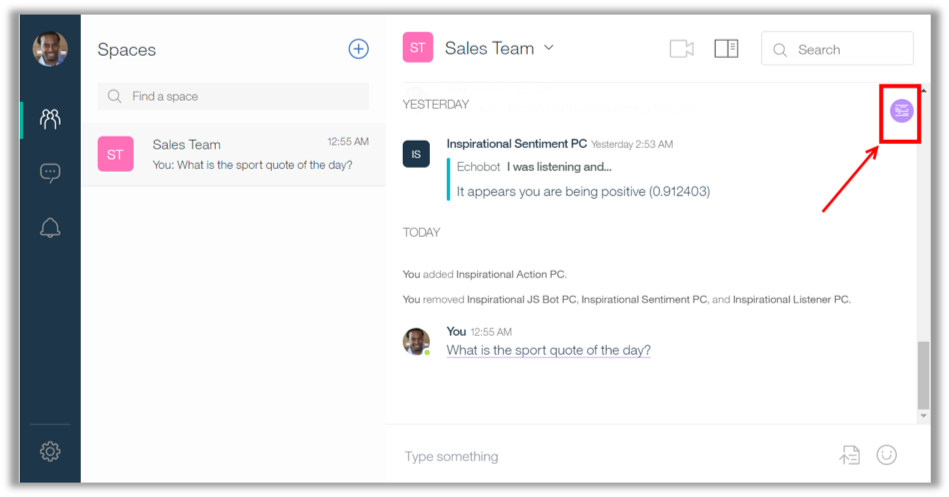
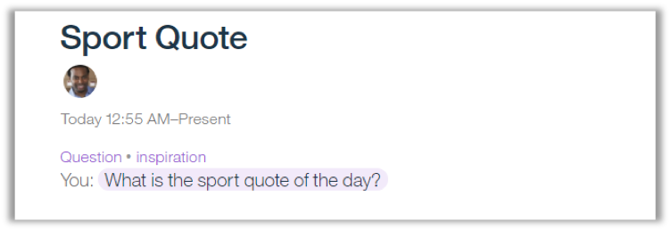

<a name="top"/>

In this section you will see how to test the Watson Conversation integration.

`_1.` Let’s add the app in the “Sales Team” space. Open the Workspace browser tab again, and the “**Sales Team**” space should be open (if not, please open it).

`_2.` On “Sales Team” space click on the “**Space Settings**” (you just need to click on the space’s name).

`_3.` Click “**Apps**”.

`_4.` Scroll down and click on your “**Inspirational Action**” (1).

`_5.` Then click on “**Add App**” button (2). If you completed any other lab, you should have some other inspirational application on the space. To avoid conflict you should remove the other apps first, you just need to open the “Apps Added to Space” and remove the other apps created for other labs. When done, **close** the Space settings dialog.

`_10.` Now we are ready to test it. On the “Sales Team” space, submit the message “**What is the sport quote of the day?**” (1).  And now you should see an underline on the message, that is the way Workspace inform you that there is an action available. If you click on the message, you are not able to complete the action. This is happening because here you need to create a code that uses the Action Fulfillment API. You will do it on the next section.

`_11.`	Another easy way to see that Watson Conversation understood your conversation is using the Moments. Let’s do it! Click on the “**Moments**” button.

`_12.`	“Moments” is a feature of Workspace that summarizes the conversation in a space. On the moments screen, you should see the latest moment of the conversation. There you should see that Watson identifies your message as a question and as “inspiration”. Inspiration is exactly the “intent” name that you created in Watson Conversation. So with Moments, you can easily see the intents identified by an integration with Watson Conversation.

*Congratulations! You trained Watson to understand your conversation. Next section, you will see how to leverage this annotation, to create a Cognitive Application for Workspace using Action Fulfillment API.*

 
[Back to Top](#top)  
