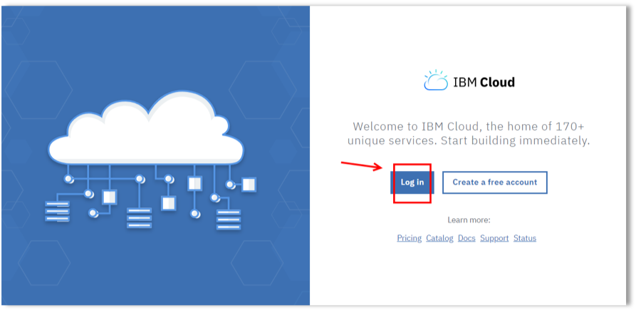
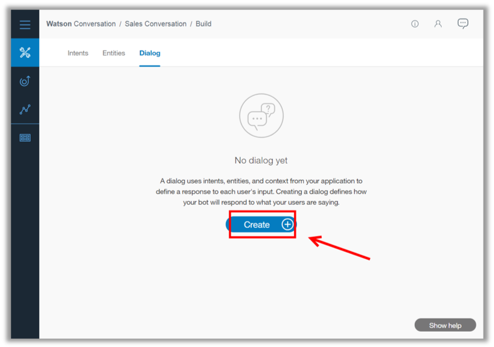

<a name="top"/>

`_1.` In your private/anonymous browser window, open a new tab.

`_2.` Open the <a href="https://console.bluemix.net/" target="blank" >IBM Cloud page</a>.

`_3.` Click “**Log In**” and access with your **user id** and **password**


`_4.` On the IBM Cloud Dashboard page, click on the **Create resource** button.


`_5.` Now on the filter field, enter “**assistant**” (1) and on the “AI” category, click on the “**Watson Assistant**” service (2)..


`_6.` On the Watson Assistant page, keep the default values and click “**Create**”.


`_7.` Great Job! Now you have your conversation service, click “**Launch tool**”.


`_8.` Congratulations! Now you are ready to create workspace to train Watson to understand your conversation. Open the “**Workspaces**” page.


`_9.` For this lab, you will create a new and simple conversation workspace. Let’s do it! Click on “**Create**” button.


`_10.` On the “Create a workspace” dialog, enter “**Inspirational Message**” (1) as the workspace name, and you are welcome to define a cool description for your workspace (2), keep “**English**” as the language (3) and click “**Create**” (4).


`_11.` Great! Now you have the Sales Conversation workspace. Let’s explore it! In a workspace, you have 3 important things that define the conversation flow: intents, entities and dialog. Let’s start with Intents. An intent represents the purpose of a user's input. You can think of intents as the actions your users might want to perform. In our case we will have only one intent: users will ask or look for motivational or inspirational messages and quotes. Let’s create our first intent. Click on “**Add intent**” button.


`_12.` Add “**#inspiration**” as the intent name (1), add “**User is looking for inspiration**” (2) as description and click “**Create intent**” (3) button.


`_13.` Now, you need to add some examples for your new intent. Examples tell the Watson Assistant service what kinds of user input you want to match the intent. The more examples you provide, the more accurate the service can be at recognizing user intents. Now add the following user examples (1)(2)(3) (you are welcome to include more): “**Where can I find some funny quotes?**”, “**What is the sport quote of the day?**”, “**I need some inspiration to start my day**” and “**I am looking for some inspirational messages**”. Then click “**Back**” (4).


`_14.` Great, now you have an intent. Let’s see another important artifact of our conversation: Entities.  Open the **Entities** tab.


`_15.` Entities represent a class of object or a data type that is relevant to a user's purpose. By recognizing the entities that are mentioned in the user's input, the Conversation service can provide more details for Watson Workspace apps. Let’s create an entity to identify the category of the quote. Click on “**Add entity**” button.


`_16.` Enter “**@category**” (1) as the “Entity name” and click “**Create entity**” (2).


`_17.` Then, you need to specify some value name and synonym for some categories. Let’s do it! Include “**sports**” (1) as category value, include the synonym “**sport**” (2) and click “**Add Value**” (3). Repeat the same steps with other categories (4) (see the picture below). When done click “**Back**” button.


`_18.` Because we are not using Watson Assistant as a chat bot, but as an engine to understand the business conversation, you will use “Dialog” objects to trigger actions in Watson Workspace.  Let’s see how to use the “Dialog” area of Watson Conversation to inform Workspace about an “action”. Open the “**Dialog**” tab.


`_19.` Your workspace shouldn’t have any dialog yet. Click “**Create**” button.


`_20.` Now you should have two default Dialog nodes: “Welcome” and “Anything_else”. You will not use these nodes. Click “**Add node**” to create a new one.


`_21.` On the new node dialog, enter “**Inspiration**” as the node’s name (1). In the “If bot recognizes”, enter “**#inspiration**” (2). Here you are configuring Watson Conversation to trigger this conversation dialog node if the “#inspiration” intent is recognized.  On the “Then respond with” section, click on the “**Options**” button (3) and select “**Open JSON editor**” (4).


`_22.` Copy and paste the JSON below in the JSON Editor area.
```
{
  "output": {
    "actions": [
      "Get_Inspired"
    ]
  }
}
```


`_23.` When you finish it, **close** the dialog.


`_24.` Now that you have your Inspiration node, go ahead and delete the “Welcome” and “Anything else” nodes. On the “Welcome” node, open the “**Options**” button (1) and click “**Delete**” (2).


`_25.` And on the confirmation dialog, click “**Yes, delete it**”.


`_26.` Repeat the same steps with the “Anything else” node.

`_27.` Great Job! You have all the objects to understand when a user is looking for inspiration. Let’s test it! Click the “**Ask Watson**” button.


`_28.` Enter “**What is the funny quote of the day?**”. Watson should identify your message as a “inspiration” intent with entity “funny” as category.
“**Ask Watson**” is good way to try your flow, but it is a good way to train Watson with new examples too. Feel free to explore it! When you finish it, close the “**Try it**” out dialog.


`_29.` Now let’s see how to integrate this Watson Conversation flow with Watson Workspace. Before we implement the integration, let’s take note of some attributes of our Watson Conversation workspace. Open the “**Deploy**” page (1). Then open the “**Credentials**” tab (2).


`_30.` On the Credentials page, you need to take a note of “**Workspace ID**” (1), “**Username**” (2) and “**Password**” (3). You will use this information later to integrate with Watson Workspace.


*Great Job! Your Watson Assistant workspace is ready! In the next section, you will integrate this Assistant workspace in your Watson Workspace app.*

<br/>
[Back to Top](#top)  
