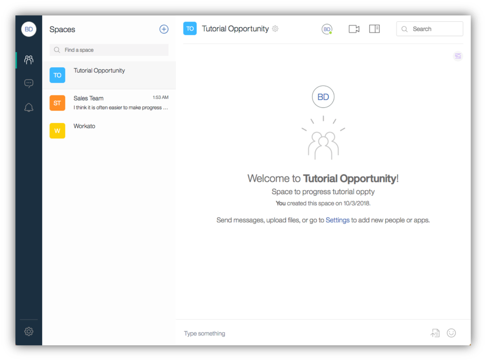

<a name="top"/>

In this section you will see how to create a space from your new Opportunity Room space template. Let’s do it!

`_1.` In your private/anonymous browser window, open a new tab.

`_2.` Open the <a href="https://login.workspace.ibm.com/" target="blank" >IBM Watson Workspace login page</a>.

`_3.` Login with your **IBMid** and **password**.

`_4.` If you see the "*Terms of Use*" screen, click **"I Agree"**.

`_5.` Click on the “**Create a Space**” button.

`_6.` You should see the “Choose Type” screen (if not, click on the “Choose Type” link on the bottom of the page). Here you should see your new “Opportunity Room” template. Click on “**Choose**” button, to create a space based in the Opportunity Room template.

`_7.` Enter “**Tutorial Opportunity**” (1) as the Space name, and you are welcome to define a cool **description** for your space (2). Enter an **"Opportunity ID"** (3), **"Contact count"** (4) and select a **"Deal Temperature"** (5). When completed, click “**Add People**” (6).

`_8.` On the next screen, you are able to invite other users to your space. However, you don’t need to add anybody yet. Then click “**Review Apps**”.

`_9.` On the “Review Apps” screen, you can review all the apps that will be added on your new space (as we defined in the template). Click “**Create**” to have your new space ready.

`_10.` Congratulations! Your new space is ready, in the next section you will explore this new space.

*Great Job! Now you are ready to explore your space.*

 
[Back to Top](#top)  
