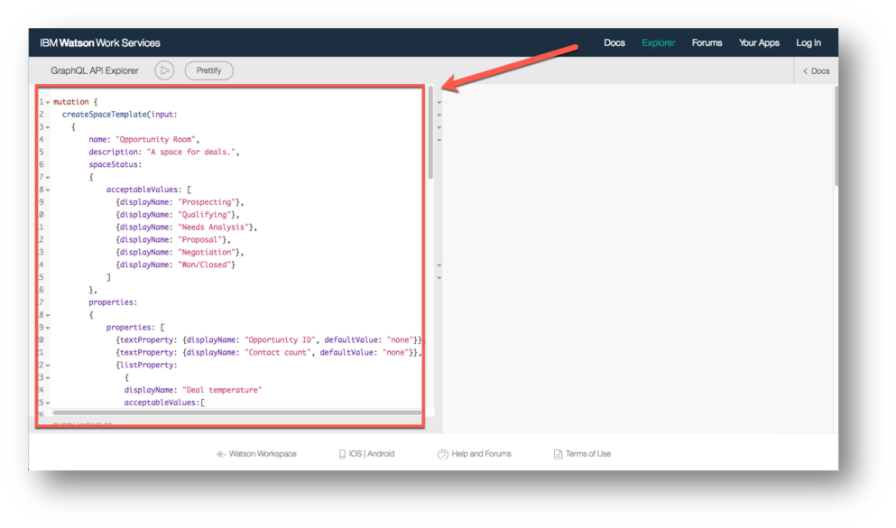
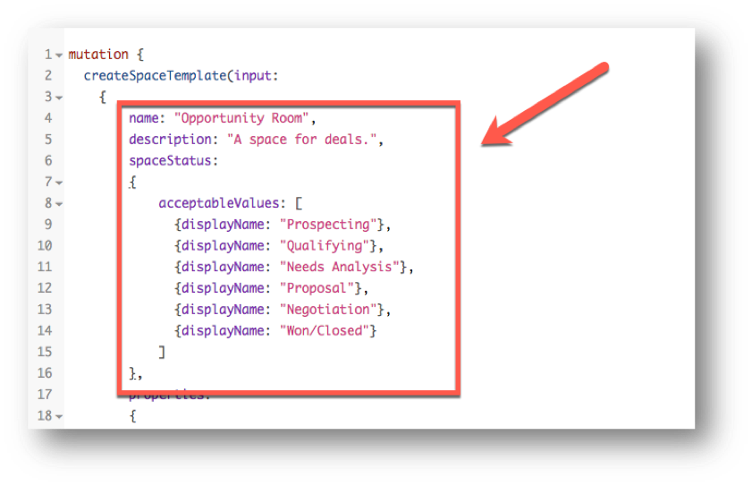
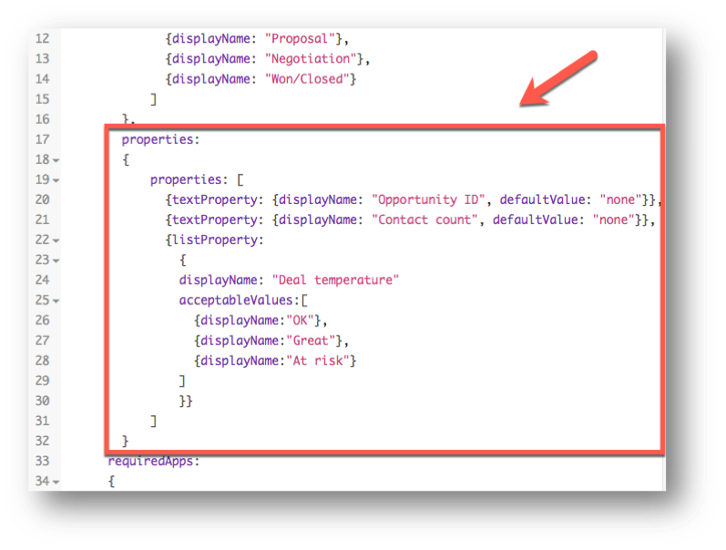
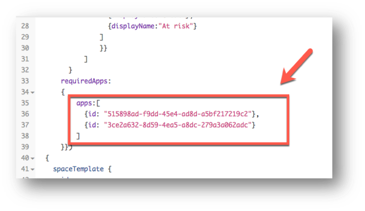
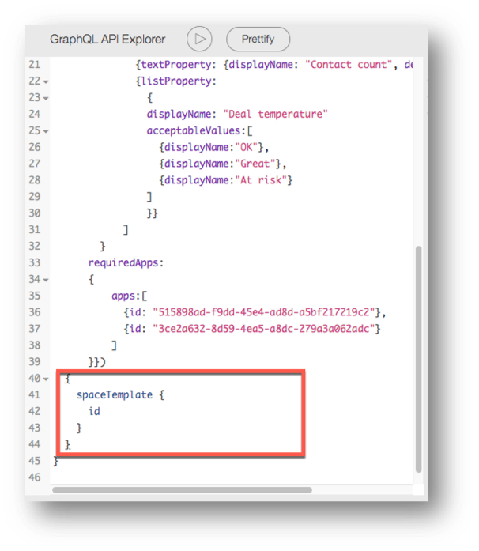
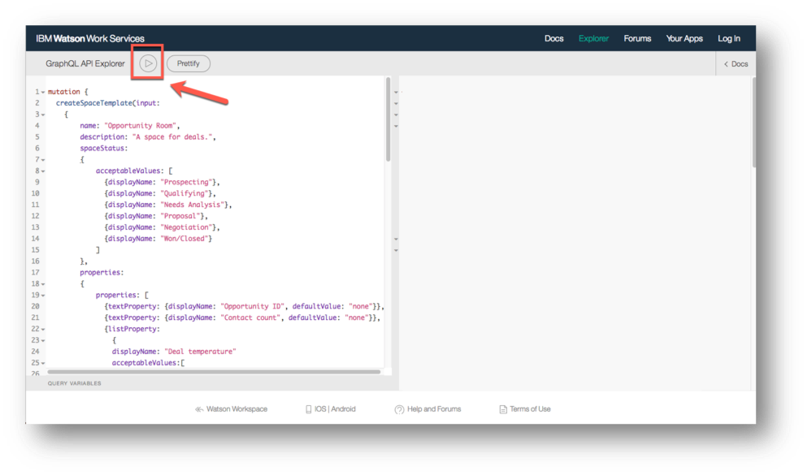
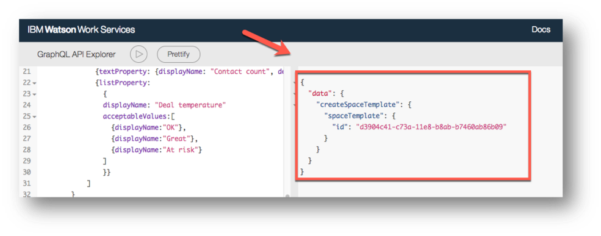

<a name="top"/>

It is really simple to create a space template using GraphQL.  In this section you will see how to create a new template using GraphQL Explorer tool (no development skill is necessary). The first step to create a template is to have a list of the required apps ID. For this lab, you don’t need to worry about the Apps ID of the Expert Finder and Inspirational Quote, this information is available for you in the table below.

<table width=60%>
<th>App</th>
<th>App ID</th>
<tr>
<td>Connections Expert Finder</td>
<td>515898ad-f9dd-45e4-ad8d-a5bf217219c2</td>
</tr>
<tr>
<td>Inspirational Quote</td>
<td>3ce2a632-8d59-4ea5-a8dc-279a3a062adc</td>
</tr>
</table>

<p/>
But in your real scenario if you have no idea how to get an App ID, please access <a href="https://ibm.box.com/s/l3bua922bvyhxm9m7nfiguhc56ervy85">this documentation</a> to learn how to do it.
<p/>
 Great! With the App IDs of the table, you are ready to create your Space Template using GraphQL. Let’s see how to do it.

`_1.` Open a browser window. Because the Template API is still Experimental, you need to use the Explorer URL below to use the Experimental APIs.
```
https://developer.watsonwork.ibm.com/tools/graphql?apiType=EXPERIMENTAL,PUBLIC,BETA
```

`_2.` Below is the GraphQL to create our Opportunity Room based on the template described in the previous section. **Copy and Paste** the code below in the GraphQL API Explorer.
```
mutation {
  createSpaceTemplate(input:
    {
      	name: "Opportunity Room",
      	description: "A space for deals.",
      	spaceStatus:
      	{
          	acceptableValues: [
              {displayName: "Prospecting"},
              {displayName: "Qualifying"},
              {displayName: "Needs Analysis"},
              {displayName: "Proposal"},
              {displayName: "Negotiation"},
              {displayName: "Won/Closed"}
            ]
        },
				properties:
      	{
          	properties: [
              {textProperty: {displayName: "Opportunity ID", defaultValue: "none"}},
              {textProperty: {displayName: "Contact count", defaultValue: "none"}},
 							{listProperty:
                {
                displayName: "Deal temperature"
          			acceptableValues:[
            			{displayName:"OK"},
            			{displayName:"Great"},
                  {displayName:"At risk"}
          			]
                }}  
            ]
        }
      requiredApps:
      {
        	apps:[
            {id: "515898ad-f9dd-45e4-ad8d-a5bf217219c2"},
            {id: "3ce2a632-8d59-4ea5-a8dc-279a3a062adc"}
          ]
      }})
	{
    spaceTemplate {
      id
    }
  }
}
```



`_3.` Before executing the GraphQL, let’s analyze it. The first part of the code, we define the template name, description and the space status: the different stages of the opportunity timeline (workflow). Those status are the stages described in the previous section.


`_4.` The second part, we define the space properties. Here we define the fields “Opportunity ID”, “Contact count” and the select option “Deal temperature”.


`_5.` On the third part, we define the required applications to be available in our Opportunity Room template.  Here we are specifying the ID of the “Connections Expert Finder” and ID of the “Inspirational  Quote” apps.


`_6.` The rest of the code is just declaring the subfields of the template to be displayed on the data result of the query.


`_7.` Great, you are ready to execute the GraphQL, click on “**Execute Query**” button (play icon) to create your template.


`_8.` You should get a spaceTemplate id if it ran successfully.


*Congratulations, your space template is ready. Next section you will see how to create a Space using this template.

<br/>
[Back to Top](#top)  
