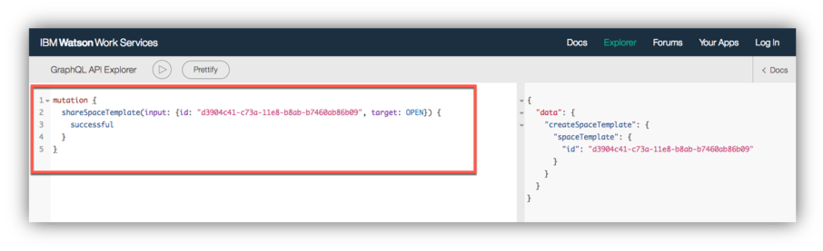
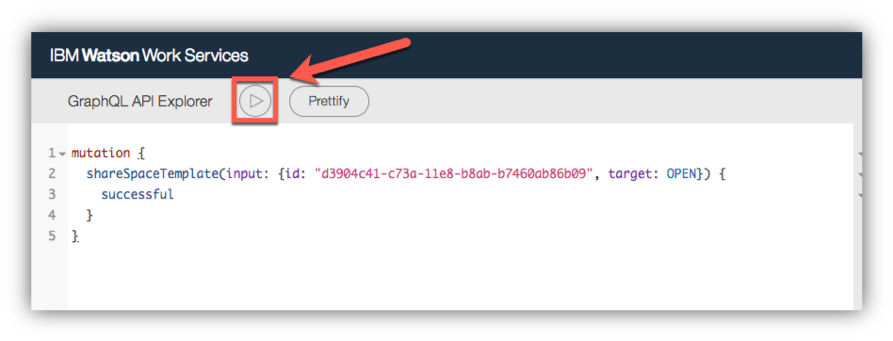
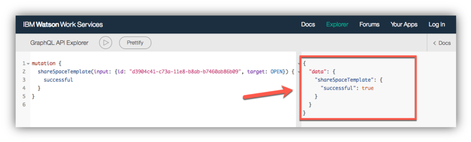
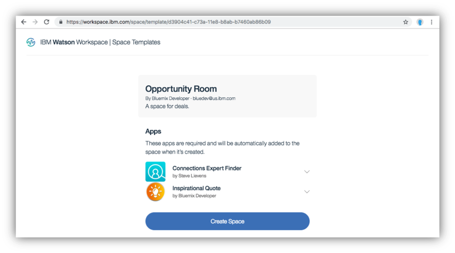

<a name="top"/>

In this section you will learn how to share your template with anyone using the share URL for your template.  To share your template, you need to use the GraphQL Explorer again. Let’s do it!

`_1.` Open a browser window. Because the Template API is still Experimental, you need to use the Explorer URL below to use the Experimental APIs.
```
https://developer.watsonwork.ibm.com/tools/graphql?apiType=EXPERIMENTAL,PUBLIC,BETA
```

`_2.` Below is the GraphQL to share our template. **Copy and Paste** the code below in the GraphQL API Explorer. Please **edit** the code to include your Template id .
```
mutation {
  shareSpaceTemplate(input: {id: "34c74????????", target: OPEN}) {
    successful
  }
}

```



`_3.` Before executing the GraphQL, let’s analyze it. The input has two required arguments, id and target. The id is the id of the template to be shared. The target denotes who the template is to be shared with. The only target currently available is OPEN, which means the template, once shared, is available to anyone who knows the template id and has permission to access openly shared templates.  In order to share a template you should be the creator of the template and all required apps in the template should already be shared (see <a href="https://github.com/watsonwork/watsonwork-developer-docs/blob/master/guides/guides/V1_ShareAnApp.md">Share an app</a> for additional information).

`_4.` Great, you are ready to execute the GraphQL, click on “**Execute Query**” button (play icon) to create your template.


`_5.` You should get a “*successful:true*” if it ran successfully.


`_6.` Great!  Your template is ready to be shared.  Once shared, templates can be accessed in Watson Workspace via a share URL. To view a shared template go to:
```
https://workspace.ibm.com/space/template/<templateId>
```
Let’s try it! Access the URL above using your template Id. You should see the page below:


*Great Job! Now you have a public page, that any Workspace user is able to create a space from your template. You are welcome to share this URL with your colleagues.  In the next section, we will show how easy is a for a Workspace Team admin, to add your template in the Team catalog, to enable all Plus user to see your template in the “Add Space” screen. If you don’t have a Plus Admin user, you are welcome to read the next section to understand the Admin process to create a Team Template Catalog. However, you will not be able to follow the lab steps without a Plus Admin user.*

<br/>
[Back to Top](#top)  
