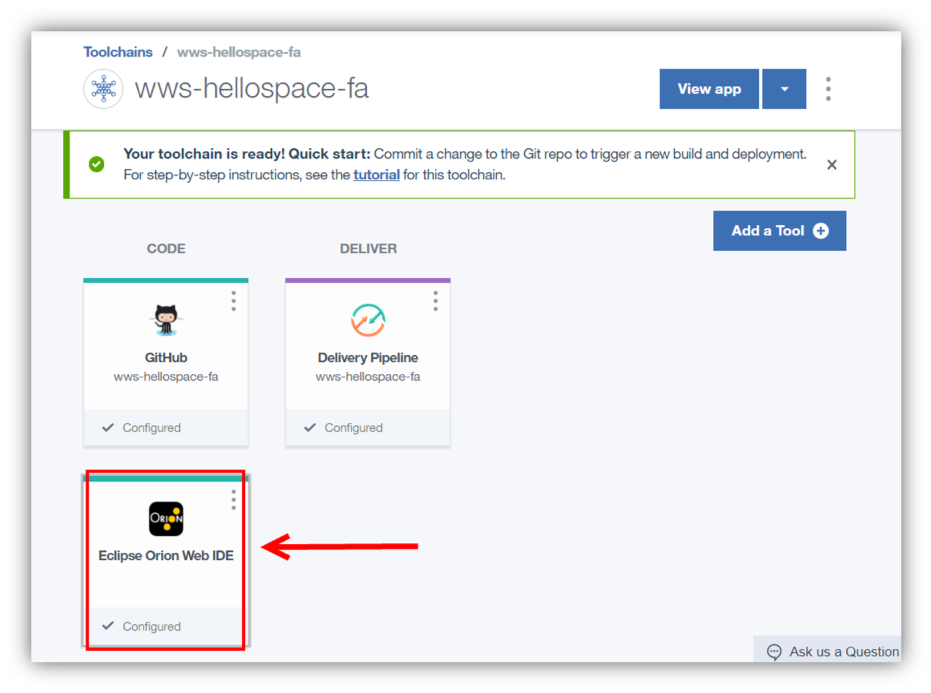
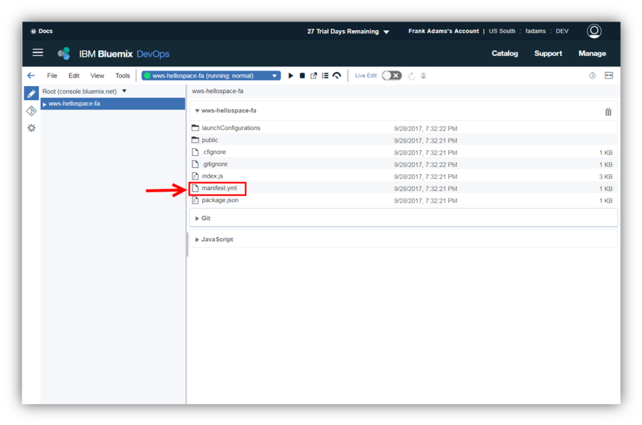
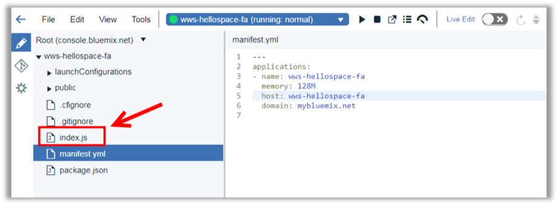
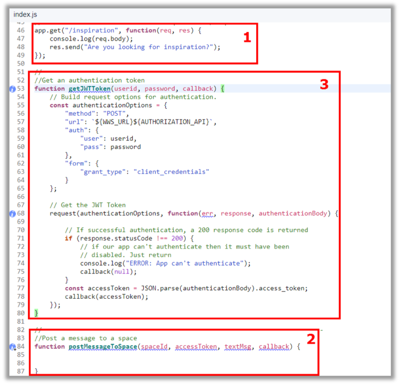
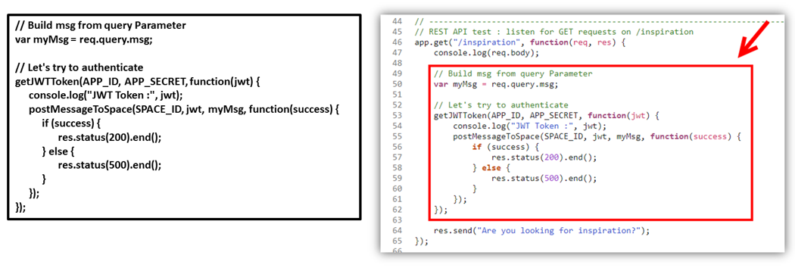
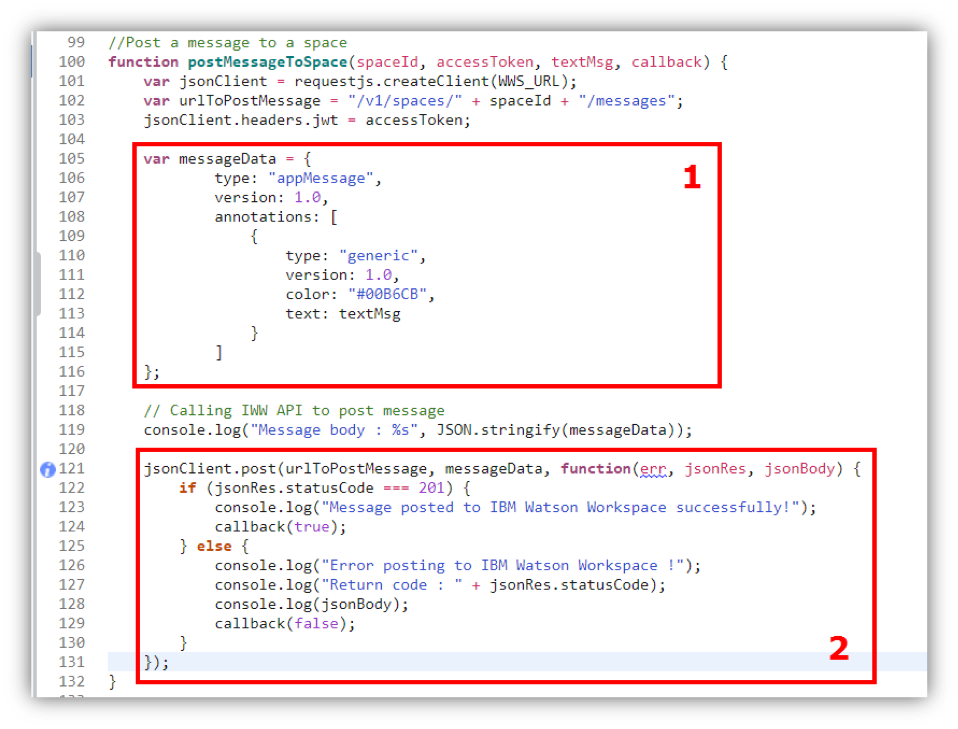

<a name="top"/>

In this section you will see how to edit an application using Eclipse Orion Web IDE on IBM Cloud.

`_1.` Back to the IBM Cloud browser, you should be on the wws-hellospace-xx Toolchain page (if you are not, on the IBM Cloud Dashboard page, open the menu and select DevOps and click on the wws-hellospace-xx app).


`_2.` Here, you will use the Eclipse Orion Web IDE to modify source code. When you edit in the Web IDE, your changes are saved to your cloud workspace. Let’s explore our app code. Open the “**Eclipse Orion Web IDE**”.


`_3.` Here you should see your application. It is a typical Node.JS application with manifest.yml, package.json, index.js and public folder. Open the “**manifest.yml**” file to edit it.


`_4.` Update the “**name**” and “**host**” from manifest.yml to reflect your app name with your initials.


`_5.` And open the “**index.js**” file.


`_6.` On the index.js let’s start changing the “**APP_ID**” (1) with the App Id value of previous step,  the “**APP_SECRET**” (2) with the App Secret value of previous step and the “**SPACE_ID**” (3) with the Sales Team space ID.  


`_7.` Let’s analyze the code of the app. It has a basic Express Server declaration and start. There are two incomplete/empty functions: **app.get** (1) and **postMessageToSpace** (2). Both you will edit. The only function ready is the “**getJWTToken**” (3). This function gets an authentication token using Work Services Authorization API. You will use this function later.


`_8.` Let’s update the app.get function. Below the console.log(req.body), insert the code below (there is a snippet file available on:
```
// Build msg from query Parameter
var myMsg = req.query.msg;

// Let's try to authenticate
getJWTToken(APP_ID, APP_SECRET, function(jwt) {
	console.log("JWT Token :", jwt);
	postMessageToSpace(SPACE_ID, jwt, myMsg, function(success) {
		if (success) {
			res.status(200).end();
		} else {
			res.status(500).end();
		}
	});
});
```  
This code will get a “msg” parameter from query string and it will authenticate in Work Services and call the “postMessageToSpace” functions sharing the msg parameter. This method will work as trigger for our Bot. When you call this get method, the bot will submit a message to space.


`_9.` Update the content of the postMessageToSpace function with the code below:
```
var jsonClient = requestjs.createClient(WWS_URL);
var urlToPostMessage = "/v1/spaces/" + spaceId + "/messages";
jsonClient.headers.jwt = accessToken;

// Building the message
var messageData = {
    type: "appMessage",
    version: 1.0,
    annotations: [
        {
            type: "generic",
            version: 1.0,
            color: "#00B6CB",
            text: textMsg
        }
    ]
};

// Calling IWW API to post message
console.log("Message body : %s", JSON.stringify(messageData));

jsonClient.post(urlToPostMessage, messageData, function(err, jsonRes, jsonBody) {
    if (jsonRes.statusCode === 201) {
        console.log("Message posted to IBM Watson Workspace successfully!");
        callback(true);
    } else {
        console.log("Error posting to IBM Watson Workspace !");
        console.log("Return code : " + jsonRes.statusCode);
        console.log(jsonBody);
        callback(false);
    }
});
```
Let’s analyze the code! This code will first create a messageData with the message received in the get method (1). At the end it calls a Watson Work Services API (2) by post to submit the message


*Now you just need to deploy your application. You will do it in the next section.*

<br/>
[Back to Top](#top)  
