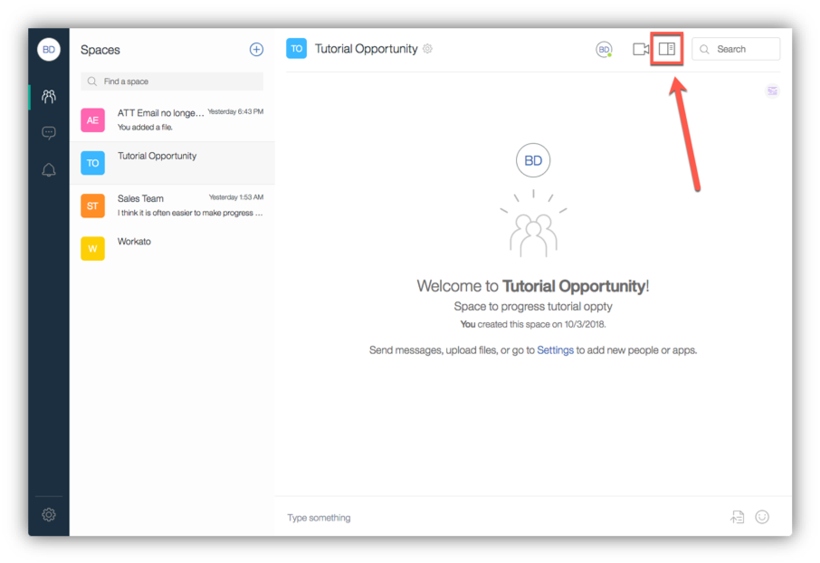

<a name="top"/>

In this section you will see the key features of the space created from a template. Let’s see it!

`_1.` On the “Tutorial Opportunity” space, click the “Show content for this space” button to see the Space content.

`_2.` On the Details view, you can see the embedded Workflow/Timeline for this type of space with all the stages of the flow (1). You also can see the space properties defined in the space creation: Opportunity ID, Contact count and Deal Temperature (2).

`_3.` Let’s see how to change a Space’s property. Click on the “**Space settings**” button (the gear near the space title).

`_4.` Now, open the **Properties** view.

`_5.` Great, here you are able to change all the properties of the space (1). You are welcome to change. When completed, please **close** the Space settings dialog (2).

`_6.` Back to the Space Details view, let’s start a simple conversation in our space, enter “**Team, I need some help to close a new deal**” (1) and click “**Send**” (2)

`_7.` Now, let’s see how to move our workflow to the next stage. It is really simple. Just click on the next stage: **Qualifying** (1).  You will see a green dot on the new stage and you will see in the space Transcript the information that “**You changed the status to Qualifying**”.

`_8.` Right now, none of our app is interacting when we change the Space status or when we change the Space property. However, it is possible to create an app, that change a CRM Sales Cycle attribute, when you change the Space status on Workflow. Next lab you will see how to change the Inspirational Quote app to send different type of message based on the Space status change. Let’s check the pre-defined apps. Enter the follow message on the space “**@inspiration**” to check if the Inspirational Quote app is available on the space.

`_9.` You should see a motivational message from the Inspirational Quote.  You are welcome to test the Connections Expert Finder app (you just need to post a message looking for a Workspace Expert, and Watson will help you to find an expert).

*Congratulations! You explored your space created from a template, and you learned how to change Space Properties and Status. Now it is really simple for any Seller to create a space to close a deal! Next step, you will see how to share your template with other users, using a Share URL.*

 
[Back to Top](#top)  
