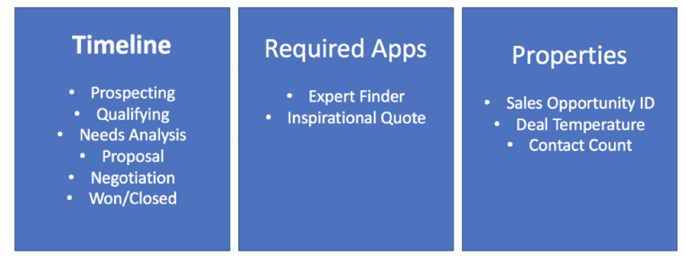

Sometimes conversations, even though critical for work, can get unwieldy.  Here's where space templates can make all the difference.  Think about a workflow that you do on a regular basis - maybe its to resolve customer service incidents, or to drive a sales lead from opportunity to signed deal.   Now imagine applying a template, to your space activity, giving you a built-in timeline to keep everyone aligned and focused on the final outcome, apps to facilitate the work, and custom properties to organize and categorize your efforts.

Now, you no longer have just a way to communicate - you truly have a workspace, optimized to make you and your team more efficient and effective.

To learn more about templates watch this short video.
<iframe width="560" height="315" src="https://www.youtube.com/embed/-rxA53tOgWU" frameborder="0" allow="autoplay; encrypted-media" allowfullscreen></iframe>

Anyone can use our <a href="https://github.com/watsonwork/watsonwork-developer-docs/blob/master/guides/Creating_Solutions.md">developer APIs</a> to create a template (Please note: These APIs are still experimental but let us know <a href="https://help.workspace.ibm.com/hc/community/topics/201192468-Developer">what you think</a>).

This lab will drive you to create a Watson Workspace Space Template to enable Sellers to progress and close sales opportunities. In a real scenario, this template will have app to integrate to a CRM solution, other to integrate to Sales Asset Repository, etc. But because the goal of this lab is to explain how easy is to create a template, we will focus on the template creation, more than in the pre-defined apps of the template. Of course, we have some pre-defined apps,  the Expert Finder App to find sales specialist to help to close the deal and our famous Inspirational Quote App, created in the previous labs (if you didn’t complete the previous lab, no problem, here you will use a pre-created app), this app will send motivational message to the sales team. At the end of the lab, you will change the inspirational message to see how to leverage Space’s information on your app to do things (your app will automatically submit different type of motivational messages based on the workflow stage).
Our Opportunity Room has a timeline, that tracks the state of the deal. The timeline is:

•	Prospecting
•	Qualifying
•	Needs Analysis
•	Proposal
•	Negotiation
•	Won/Closed

And it indicates where the opportunity is, helps folks who are trying to gauge near term and long-term pipeline of sales. Also, the team wants to make sure the deal stays on track, and if it gets derailed, they want to let everyone know, so they keep a Deal Temperature - when it goes at risk, they need to step it up.

And keeping track of a simple rule of thumb, the number of times they contact the client around this deal, is a good metric to make everyone aware of.

The picture below describes the Template structure: timeline (workflow), required apps and space properties.

Now that we know what we want, we need to figure out how to build it with Watson Work Services. Let’s see in the next section.
