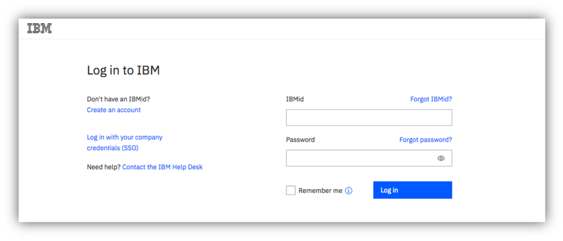
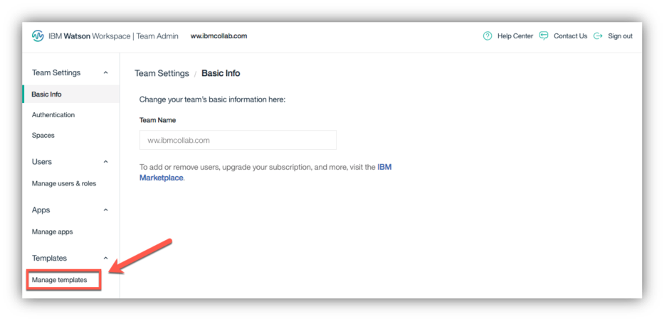
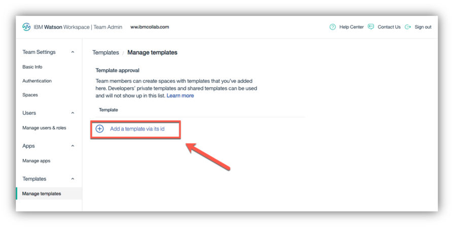
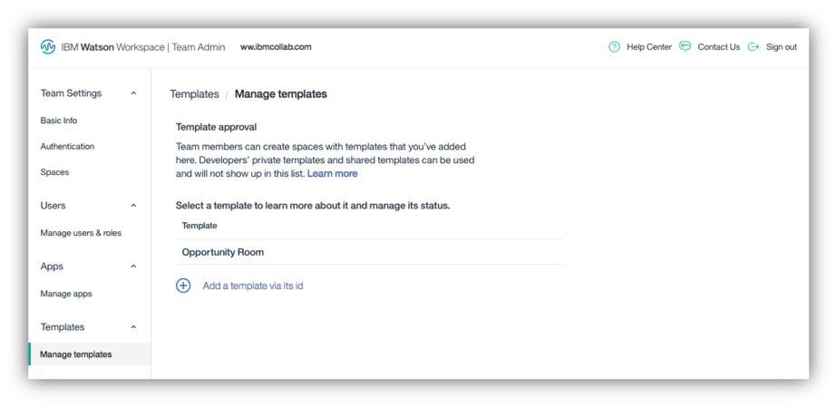

<a name="top"/>

In this section you will learn how to create a Team Template Catalog to enable all Plus users of your team to see template from different owners. Team administrators can add and manage space templates available to team members in the Admin portal.  Approved space templates will be available to team members when they create a space. Let’s see how to do it!

`_1.` In your private/anonymous browser window, open a new tab.

`_2.` Open the <a href="http://admin.workspace.ibm.com/" target="blank" >IBM Watson Workspace Team Admin page</a>.

`_3.` Login with your Team Admin **IBMid** and **password**.

`_4.` Click **Templates** and choose **Manage Templates**.

`_5.` Click "**Add template via its id**".

`_6.` Paste your "**Opportunity Room template id**" (1) and click **Add** (2).

`_7.` The template you added will display in the list of approved templates.

*Congratulations! Now your team has a Team Template Catalog. Any Workspace Plus user of your team, will see your Opportunity Room template when they click to create a new space. Here you complete the lab about how to create and manage Space Templates. You learned how to create a space template, how to create a space from a template, how to share a template and how to manage a template with a Team Template Catalog.*

 
[Back to Top](#top)  
